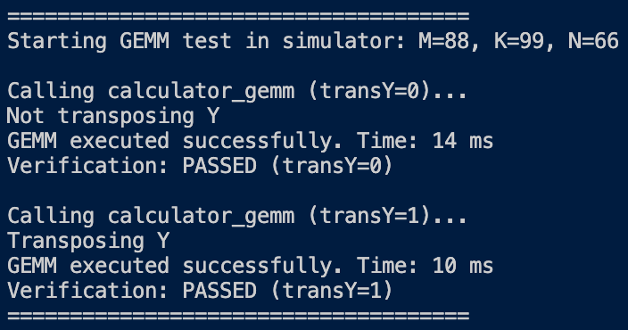

# Lab 4 实验报告

姓名：陈泽超
学号：22551014

### 实验数据记录

- 无论是实体设备还是使用模拟器，启动参数的最后三位分别是矩阵尺寸的M、K、N

| 实验编号 | 实现方式 | 设备/模拟器 | 矩阵尺寸 (M×K×N) | 计算耗时 (ms) | 备注 |
|---:|---|---|---:|---:|---:|
| 1 | 朴素 baseline | 模拟器 | 64×64×64 |  37 ms |  |
| 2 | HVX 内积 (A * B^T) | 模拟器 | 64×64×64 |  5 ms |  |
| 3 | HVX 外积 (A * B) | 模拟器 | 64×64×64 |  1 ms |  |
| 4 | 朴素 baseline | 模拟器 | 256×256×256 | 2390 ms  |  |
| 5 | HVX 内积 (A * B^T) | 模拟器 | 256×256×256 |  164 ms |  |
| 6 | HVX 外积 (A * B) | 模拟器 | 256×256×256 | 123 ms  |  |
| 7 | 朴素 baseline | 模拟器 | 512×512×512 | 19083 ms  |  |
| 8 | HVX 内积 (A * B^T) | 模拟器 | 512×512×512 | 1104 ms  |  |
| 9 | HVX 外积 (A * B) | 模拟器 | 512×512×512 | 985 ms  |  |
| 10 | 朴素 baseline | 模拟器 | 88×99×66 | 82 ms  |  |
| 11 | HVX 内积 (A * B^T) | 模拟器 | 88×99×66 | 10 ms  |  |
| 12 | HVX 外积 (A * B) | 模拟器 | 88×99×66 | 14 ms  |  |

### 实验结果图示




### 结果分析

从实验数据可以看出，HVX 向量化实现相比朴素的标量实现，在各种矩阵尺寸下都取得了显著的性能提升，加速比普遍在10倍以上。这充分证明了利用 DSP 的 SIMD 能力进行并行计算的巨大优势。

#### 1. 内积与外积实现对比

在本次实验中，我们实现了两种基于 HVX 的矩阵乘法：`matmul_ijk_transposed_b` (内积形式) 和 `matmul_ikj` (外积形式)。

- **外积 (`matmul_ikj`)**:
  - **数据访问模式**: `C[i][j:j+31] += A[i][k] * B[k][j:j+31]`。在最内层循环中，矩阵 A 的单个元素 `A[i][k]` 被广播成一个向量，与矩阵 B 的一整行向量 `B[k][j:j+31]` 进行乘加运算。
  - **数据复用**: 矩阵 A 的元素 `A[i][k]` 在 `j` 循环中被重复广播使用，直到 `k` 改变。矩阵 B 的行向量在 `i` 循环中被重复加载。这种模式对 B 的数据局部性非常友好。
  - **向量指令**: 主要使用 `Q6_V_vsplat_R` (标量广播) 和 FMA (Fused Multiply-Add) 操作 `Q6_Vqf32_vadd_Vqf32Vqf32(..., Q6_Vqf32_vmpy_VsfVsf(...))`。
  - **性能**: 从数据上看，外积在大多数情况下性能优于内积。这是因为它避免了内积实现中昂贵的向量归约（reduction）操作，并且内存访问模式更规则、更高效。

- **内积 (`matmul_ijk_transposed_b`)**:
  - **数据访问模式**: `C[i][j] = dot(A[i][k:k+31], B_T[j][k:k+31])`。它计算矩阵 A 的一个行向量和转置后的矩阵 B 的一个行向量（即原矩阵 B 的列向量）的点积。
  - **数据复用**: 矩阵 A 的行向量 `A[i]` 在 `j` 循环中被重复加载，具有良好的时间局部性。
  - **向量指令**: 主要使用 `Q6_Vqf32_vmpy_VsfVsf` 进行向量逐元素相乘，然后通过 `Q6_V_vror_VR` (向量旋转) 和 `Q6_Vqf32_vadd_Vqf32Vqf32` (向量加法) 实现向量归约，将一个向量的所有元素相加得到一个标量。
  - **性能**: 归约操作（通过多次旋转和相加）引入了额外的指令开销和数据依赖，导致其性能通常略逊于外积法。但在某些特定架构或缓存模型下，其良好的数据局部性可能带来优势。

#### 2. 关键 HVX 指令详解

在 `calculator_imp.c` 的 HVX 实现中，我们使用了以下关键指令来提升性能：

1.  **`Q6_V_vzero()`**:
    - **作用**: 创建一个所有元素都为零的 128 字节向量。
    - **应用**: 在循环开始前，用它来初始化用于累加结果的向量寄存器，确保每次点积或外积的累加计算都从零开始。

2.  **`Q6_V_vsplat_R()`**:
    - **作用**: 将一个 32 位浮点标量广播（复制）到目标向量的所有 32 个 `float` 位置。
    - **应用**: 这是外积法 (`matmul_ikj`) 的核心。它将矩阵 A 的单个元素变成一个完整的向量，以便与矩阵 B 的行向量进行 SIMD 乘法，从而一次性完成 32 次乘法运算。

3.  **`Q6_Vqf32_vmpy_VsfVsf()`**:
    - **作用**: 对两个标准浮点 (SF) 格式的向量进行逐元素相乘，结果以高精度 (QF32) 格式存储。
    - **应用**: 在内积和外积法中都用于执行核心的并行乘法。一条指令可以完成 32 次浮点乘法，这是性能提升的主要来源。

4.  **`Q6_Vqf32_vadd_Vqf32Vqf32()`**:
    - **作用**: 将两个高精度 (QF32) 格式的向量进行逐元素相加。
    - **应用**: 用于累加乘法结果。在外积法中，它实现了 FMA (Fused Multiply-Add) 操作；在内积法的归约步骤中，它用于将向量的不同部分相加。

5.  **`Q6_V_vror_VR()`**:
    - **作用**: 将向量按字节循环右移指定的距离。
    - **应用**: 这是内积法 (`matmul_ijk_transposed_b`) 实现向量归约的关键。通过将向量对半、四分之一等距离旋转，并与原向量相加，可以在对数时间内（log(32)）将向量中所有元素的值累加到向量的第一个元素上。

6.  **`Q6_Vsf_equals_Vqf32()`**:
    - **作用**: 将高精度的 QF32 格式向量转换回标准的 SF 浮点格式。
    - **应用**: 在所有累加计算完成后，将累加器中的高精度结果转换回标准浮点格式，以便存回内存或进行后续的标量处理。

#### 3. 优化建议

当前实现已经考虑了对齐和尾部处理，但仍有优化空间：

1.  **尾部与对齐处理**:
    - **当前策略**: 代码中通过 `memcpy` 将非对齐的内存块复制到对齐的栈上缓冲区，然后再进行向量加载/存储。这虽然能保证功能正确，但 `memcpy` 本身有开销。
    - **优化建议**:
        - **非对齐加载/存储指令**: Hexagon 提供了非对齐的向量加载/存储指令（如 `Q6_V_vldu_A`），虽然性能低于对齐加载，但可能比 `memcpy` 更快。可以尝试替换 `memcpy` 方案进行性能对比。
        - **数据预处理**: 如果可能，在调用 GEMM 前就确保输入矩阵的行在内存中是 128 字节对齐的。这可以通过自定义的内存分配器实现，从而在计算循环中完全避免对齐处理的开销。

2.  **缓存与内存带宽**:
    - **瓶颈**: 矩阵乘法是计算密集型也是访存密集型任务。当矩阵尺寸增大时，数据无法完全放入 L1/L2 缓存，频繁的 DRAM 访问会成为瓶颈。
    - **优化建议**:
        - **数据预取 (Prefetching)**: 使用 `l2fetch` 等预取指令。在处理当前数据块时，提前通知内存系统将下一个将要用到的数据块（例如 `A[i+1]` 或 `B[k+1]` 的数据）加载到 L2 缓存中。这可以掩盖内存访问延迟，提高流水线效率。例如，在 `k` 循环内部，可以预取 `&input_matrix2[(k+1) * n + j]`。
        - **循环分块 (Tiling/Blocking)**: 将大矩阵切分成小的子矩阵（Block），大小以能完全放入 L1 或 L2 缓存为准。通过对子矩阵进行计算，可以最大化数据复用，极大减少对主内存的访问次数。这是矩阵乘法优化的最关键技术之一。

3.  **多线程并行**:
    - **当前策略**: 代码中定义了 `THREAD_COUNT` 但并未使用。
    - **优化建议**: 可以将 `m` 维（外层循环）分配给多个线程。例如，每个线程负责计算输出矩阵的一部分行。这可以在多核 DSP 上实现进一步的并行加速。需要使用 `qurt_thread_create` 等 QuRT API 来创建和管理线程。


### 实现代码
```c
// HVX 外积实现的核心代码片段
static inline void matmul_ikj(float *restrict input_matrix1,
                 float *restrict input_matrix2,
                 float *restrict output,
                 uint32_t m,
                 uint32_t p,
                 uint32_t n) {
    const int n_vector_width = HVX_VECTOR_SIZE_FLOATS;
    const int n_fit = n - (n % n_vector_width);
    memset(output, 0, m * n * sizeof(float));
    if (n % n_vector_width == 0) {
        for (int i = 0; i < m; i++) {
            for (int j = 0; j < n_fit; j += n_vector_width) {
                HVX_Vector v_c_qf = Q6_V_vzero(); // Initialize accumulator vector in qf format
                for (int k = 0; k < p; k++) {
                    float a = input_matrix1[i * p + k];
                    HVX_Vector v_a_sf = Q6_V_vsplat_R(float_to_bits(a));
                    
                    // Load B vector (sf) and convert to qf
                    HVX_Vector v_b_sf = *((HVX_Vector *)&input_matrix2[k * n + j]);

                    // FMA: c_qf = c_qf + a_sf * b_qf
                    v_c_qf = Q6_Vqf32_vadd_Vqf32Vqf32(v_c_qf, Q6_Vqf32_vmpy_VsfVsf(v_a_sf, v_b_sf));
                }
                // Convert final result back to sf and store
                HVX_Vector c_updated_sf = Q6_Vsf_equals_Vqf32(v_c_qf);
                *((HVX_Vector *)&output[i * n + j]) = c_updated_sf;
            }
        }    
    } else {
        for (int i = 0; i < m; i++) {
            for (int j = 0; j < n_fit; j += n_vector_width) {
                HVX_Vector v_c_qf = Q6_V_vzero(); // Initialize accumulator vector in qf format
                for (int k = 0; k < p; k++) {
                    float a = input_matrix1[i * p + k];
                    HVX_Vector v_a_sf = Q6_V_vsplat_R(float_to_bits(a));
                    
                    // Load B vector with proper handling of potentially unaligned data
                    HVX_Vector v_b_sf;
                    float *b_ptr = &input_matrix2[k * n + j];
                    // Unaligned access - copy to aligned buffer first
                    float aligned_buffer[HVX_VECTOR_SIZE_FLOATS] __attribute__((aligned(HVX_VECTOR_SIZE_BYTES)));
                    memcpy(aligned_buffer, b_ptr, HVX_VECTOR_SIZE_BYTES);
                    v_b_sf = *((HVX_Vector *)aligned_buffer);
                    
                    // FMA: c_qf = c_qf + a_sf * b_qf
                    v_c_qf = Q6_Vqf32_vadd_Vqf32Vqf32(v_c_qf, Q6_Vqf32_vmpy_VsfVsf(v_a_sf, v_b_sf));
                }
                // Convert final result back to sf and store with proper alignment handling
                HVX_Vector c_updated_sf = Q6_Vsf_equals_Vqf32(v_c_qf);
                float *c_ptr = &output[i * n + j];
                // Unaligned store - use temporary buffer
                float aligned_buffer[HVX_VECTOR_SIZE_FLOATS] __attribute__((aligned(HVX_VECTOR_SIZE_BYTES)));
                *((HVX_Vector *)aligned_buffer) = c_updated_sf;
                memcpy(c_ptr, aligned_buffer, HVX_VECTOR_SIZE_BYTES);
            }
            // Scalar tail for j
            for (int j_tail = n_fit; j_tail < n; j_tail++) {
                for (int k = 0; k < p; k++) {
                    output[i * n + j_tail] += input_matrix1[i * p + k] * input_matrix2[k * n + j_tail];
                }
            }
        }
    }
    return;
}
```
```c
// HVX 内积实现的核心代码片段
static inline void matmul_ijk_transposed_b(float *restrict input_matrix1,
                                     float *restrict input_matrix2,
                                     float *restrict output,
                                     uint32_t m,
                                     uint32_t p,
                                     uint32_t n) {
    const int n_vector_width = HVX_VECTOR_SIZE_FLOATS;
    const int p_fit = p - (p % n_vector_width);

    for (int i = 0; i < m; i++) {
        for (int j = 0; j < n; j++) {
            HVX_Vector sum_qf = Q6_V_vzero();
            for (int k = 0; k < p_fit; k+= n_vector_width) {
                float *a_begin_ptr = &input_matrix1[i * p + k];

                HVX_Vector *v_a_ptr = (HVX_Vector *)a_begin_ptr;
                // HVX_Vector v_a;
                // if ((uintptr_t)a_begin_ptr % HVX_VECTOR_SIZE_BYTES == 0) {
                //     v_a_ptr = (HVX_Vector *)a_begin_ptr;
                // } else {
                //     // printf("vector a not aligned\n");
                //     memcpy(&v_a, a_begin_ptr, HVX_VECTOR_SIZE_BYTES);
                //     v_a_ptr = &v_a;
                // }
                float *b_begin_ptr = &input_matrix2[k * n + j];
                HVX_Vector *v_b_ptr = (HVX_Vector *)b_begin_ptr;
                // HVX_Vector v_b;
                // if ((uintptr_t)b_begin_ptr % HVX_VECTOR_SIZE_BYTES == 0) {
                //     v_b_ptr = (HVX_Vector *)b_begin_ptr;
                // } else {
                //     // printf("vector b not aligned\n");
                //     memcpy(&v_b, b_begin_ptr, HVX_VECTOR_SIZE_BYTES);
                //     v_b_ptr = &v_b;
                // }
                HVX_Vector mul_qf32 = Q6_Vqf32_vmpy_VsfVsf(*v_a_ptr, *v_b_ptr);
                sum_qf = Q6_Vqf32_vadd_Vqf32Vqf32(sum_qf, mul_qf32);

            }
            // reduce mul_qf32
            for (int half = n_vector_width / 2; half >= 1; half /= 2) {
                HVX_Vector tmp = Q6_V_vror_VR(sum_qf, half * sizeof(float));
                sum_qf = Q6_Vqf32_vadd_Vqf32Vqf32(sum_qf, tmp);
            }

            // transform back to standard IEEE 754 float
            HVX_Vector sum_sf = Q6_Vsf_equals_Vqf32(sum_qf);
            float final_sum = ((float *)&sum_sf)[0];
            for (int k_tail = p_fit; k_tail < p; k_tail++) {
                final_sum += input_matrix1[i * p + k_tail] * input_matrix2[k_tail * n + j];
            }
            output[i * n + j] = final_sum;
        }
    }
    return;
}
```