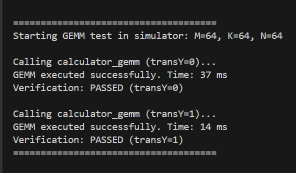
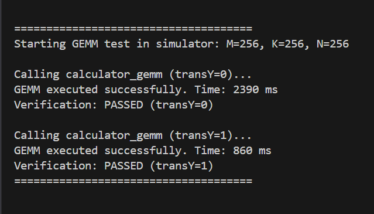
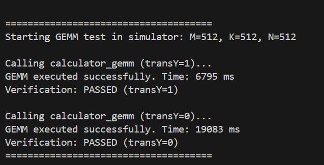
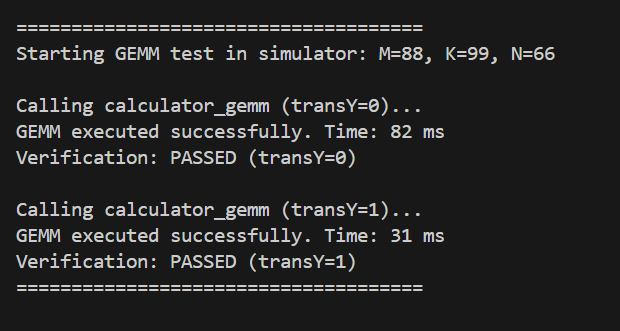
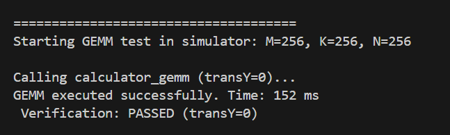
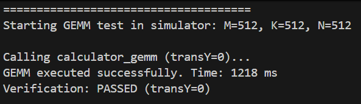
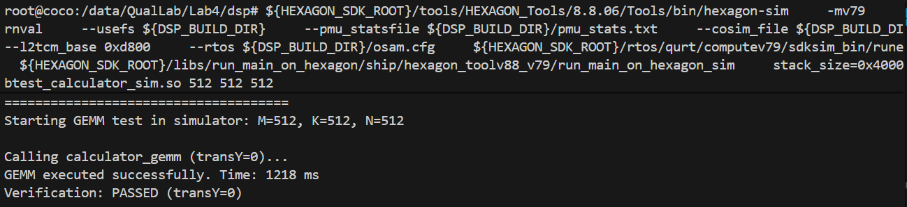
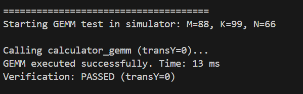

# 实验四：Hexagon NPU GEMM

### **1. 代码逻辑**

#### (1) 外积形式

A\[i][k] × B\[k][j:j+31] → C\[i][j:j+31]

```
static inline void matmul_ijk(float *restrict input_matrix1,
                 float *restrict input_matrix2,
                 float *restrict output,
                 uint32_t m,
                 uint32_t k,
                 uint32_t n) {
 
    const uint32_t VEC_F32 = 32; 
    uint32_t n_vec_blocks = n / VEC_F32;
    uint32_t n_tail = n % VEC_F32;
 
    memset(output, 0, (size_t)m * n * sizeof(float));
 
    HVX_Vector tmp_bvec;  
    HVX_Vector tmp_outvec; 
 
    for (uint32_t i = 0; i < m; ++i) {
        float *C_row = output + (size_t)i * n;      
        float *A_row = input_matrix1 + (size_t)i * k; 
 
        for (uint32_t nb = 0; nb < n_vec_blocks; ++nb) {
            HVX_Vector acc = Q6_V_vzero();
 
            for (uint32_t p = 0; p < k; ++p) {
                float a_ip = A_row[p];
                HVX_Vector vsplat = Q6_V_vsplat_R(float_to_bits(a_ip));
 
                float *b_ptr = input_matrix2 + (size_t)p * n + (size_t)nb * VEC_F32;
 
                if (((uintptr_t)b_ptr & 127) == 0) {
                    const HVX_Vector *bvec_ptr = (const HVX_Vector *)b_ptr;
                    HVX_Vector bvec = *bvec_ptr;
                    HVX_Vector prod = Q6_Vqf32_vmpy_VsfVsf(vsplat, bvec);
                    acc = Q6_Vqf32_vadd_Vqf32Vqf32(acc, prod);
                } else {
                    memcpy(&tmp_bvec, b_ptr, VEC_F32 * sizeof(float));
                    HVX_Vector prod = Q6_Vqf32_vmpy_VsfVsf(vsplat, tmp_bvec);
                    acc = Q6_Vqf32_vadd_Vqf32Vqf32(acc, prod);
                }
            }
 
            HVX_Vector out_vec = Q6_Vsf_equals_Vqf32(acc);
            float *c_ptr = C_row + (size_t)nb * VEC_F32;
 
            if (((uintptr_t)c_ptr & 127) == 0) {
                memcpy(c_ptr, &out_vec, VEC_F32 * sizeof(float));
            } else {
                memcpy(&tmp_outvec, &out_vec, VEC_F32 * sizeof(float));
                memcpy(c_ptr, &tmp_outvec, VEC_F32 * sizeof(float));
            }
        }
 
        if (n_tail) {
            uint32_t jbase = n_vec_blocks * VEC_F32;
            for (uint32_t j = 0; j < n_tail; ++j) {
                float sum = 0.0f;
                for (uint32_t p = 0; p < k; ++p) {
                    sum += A_row[p] * input_matrix2[p * n + jbase + j];
                }
                C_row[jbase + j] = sum;
            }
        }
    }
}
```

#### (2) 内积形式

A\[i][k:k+31] · B\[j][k:k+31] → C\[i][j]

```
static inline void matmul_ikj_transposed_b(float *restrict input_matrix1,
                                           float *restrict input_matrix2,
                                           float *restrict output,
                                           uint32_t m,
                                           uint32_t k,
                                           uint32_t n) {
     
    size_t bt_size = (size_t)n * k * sizeof(float);
    float *bt = malloc(bt_size);
    if (bt == NULL) {
        return;
    }
 
    for (uint32_t i = 0; i < k; ++i) {
        for (uint32_t j = 0; j < n; ++j) {
            bt[(size_t)j * k + i] = input_matrix2[(size_t)i * n + j];
        }
    }
 
    for (uint32_t i = 0; i < m; ++i) {
        float *row_a = input_matrix1 + (size_t)i * k;
        for (uint32_t j = 0; j < n; ++j) {
            float *row_bt = bt + (size_t)j * k;  
            float sum = 0.0f;
            uint32_t kk;
            for (kk = 0; kk + 31 < k; kk += 32) {
                HVX_Vector va;
                memcpy(&va, row_a + kk, sizeof(HVX_Vector));
                HVX_Vector vb;
                memcpy(&vb, row_bt + kk, sizeof(HVX_Vector));
                HVX_Vector vmul = Q6_Vqf32_vmpy_VsfVsf(va, vb);
                HVX_Vector s = vmul;
                int shift_bytes = 64;  
                for (int step = 0; step < 5; ++step) { 
                    HVX_Vector r = Q6_V_vror_VR(s, shift_bytes);
                    s = Q6_Vqf32_vadd_Vqf32Vqf32(s, r);
                    shift_bytes >>= 1; 
                }
                 
                HVX_Vector sfv = Q6_Vsf_equals_Vqf32(s);
                union {
                    HVX_Vector v;
                    float f[32];
                } u;
                u.v = sfv;
                float partial = u.f[0];
                sum += partial;
            }
            for (; kk < k; ++kk) {
                sum += row_a[kk] * row_bt[kk];
            }
            output[(size_t)i * n + j] = sum;
        }
    }
    free(bt);
}
```

### 2. **实验结果**

| 实验编号 |      实现方式      | 矩阵尺寸 (M×K×N) | 计算耗时 (ms) |
| :------: | :----------------: | :--------------: | :-----------: |
|    1     |   朴素 baseline    |     64×64×64     |      37       |
|    2     | HVX 内积 (A * B^T) |     64×64×64     |      14       |
|    3     |  HVX 外积 (A * B)  |     64×64×64     |       2       |
|    4     |   朴素 baseline    |   256×256×256    |     2390      |
|    5     | HVX 内积 (A * B^T) |   256×256×256    |      860      |
|    6     |  HVX 外积 (A * B)  |   256×256×256    |      152      |
|    7     |   朴素 baseline    |   512×512×512    |     19083     |
|    8     | HVX 内积 (A * B^T) |   512×512×512    |     6795      |
|    9     |  HVX 外积 (A * B)  |   512×512×512    |     1218      |
|    10    |   朴素 baseline    |     88×99×66     |      82       |
|    11    | HVX 内积 (A * B^T) |     88×99×66     |      31       |
|    12    |  HVX 外积 (A * B)  |     88×99×66     |      13       |


















### 3. **结果分析**

#### (1) **对比内积与外积在数据复用、内存访问模式与向量指令使用上的差异**

**数据复用**

内积法的数据复用主要体现在A上，A的每一行可以在多个输出行计算中被反复使用。

外积法的数据复用主要体现在B上，B的每一行可以在多个输出行计算中被反复使用。

**内存访问模式**

内积法的访问完全是顺序的，A和B_T的行都是连续存储的，每个输出元素对应一对连续向量的点积。归约阶段将32个浮点结果归并为一个标量输出。

外积法的访问模式更复杂，A是按标量访问的，通过广播被扩展为一个完整的向量；B的行是连续访问的，适合向量加载；而C的多列结果则被同时维护在多个寄存器中，在所有累加完成后统一写回内存。

**向量指令的使用**

内积法侧重于向量对向量的乘法和归约操作。

外积法则强调标量广播和多输出累加操作。

#### （2）**关键 HVX 指令详解：指出在代码中使用到的每种 HVX 指令（例如 Q6_V_vsplat_R、Q6_Vqf32_vmpy_VsfVsf、Q6_Vqf32_vadd_Vqf32Vqf32、Q6_V_vror_VR 等）并解释它们在你的实现中如何改善性能**

**Q6_V_vsplat_R()**，将一个标量寄存器中的32位值广播到整个向量寄存器的32个槽位中。在外积式实现中，每次处理矩阵A的一个元素 `A[i][p]` 时，通过 `Q6_V_vsplat_R(float_to_bits(A[i][p]))`，只需一次广播，就能在寄存器层面生成32个并行乘数，从而减少了标量向量间的切换开销，也降低了内存访问次数。

 **Q6_Vqf32_vmpy_VsfVsf()**，即向量浮点逐元素乘法。该指令会在一个时钟周期内对两个向量的每个对应元素执行乘法。矩阵乘法的核心运算就是大量的乘积累加，使用该指令可以一次并行计算32个乘法，相当于将传统的循环展开32倍。

**Q6_Vqf32_vadd_Vqf32Vqf32()**，即向量浮点加法指令。它将两个向量寄存器中的对应元素相加，形成新的向量结果。该指令在矩阵乘法中用于将每个维度的乘积累积到输出寄存器中，提高了寄存器复用效率。

 **Q6_V_vror_VR()**，即向量右旋。该指令将向量内的元素循环右移指定字节数。矩阵乘法在内积形式下最终需要把一个32元素向量的累积结果求和为单一标量，先旋转16个元素并加，再旋转8、4、2、1依次叠加，最终将全部32个元素汇聚到一个寄存器槽位中。相比逐元素求和，大幅降低了归约阶段的指令数量与分支代价。

#### (3) 针对尾部、对齐、缓存与内存带宽瓶颈提出优化建议。

**尾部**

当向量宽度为32而k或n不是32的倍数时，把主路径限制为`( len / 32 ) * 32`，把剩余`len % 32`元素用标量回退处理。

优化可以为尾部分配一个32长的临时缓冲，把尾部拷贝进缓冲并用0填满剩余槽位，然后用向量路径处理这 32 个元素再把结果累加到总和里。

**对齐**

处理地址不是128字节对齐的情形，提前设置临时aligned向量缓冲，然后将未对齐的数据复制到该对齐的向量缓冲区，从而安全地参与后续HVX指令计算。

**缓存与内存带宽瓶颈**

核心是提高数据复用、减少访存次数。通过将矩阵分块使同一数据在缓存中被多次使用，结合对 B 矩阵的打包以实现顺序对齐访问，可显著降低带宽压力。

