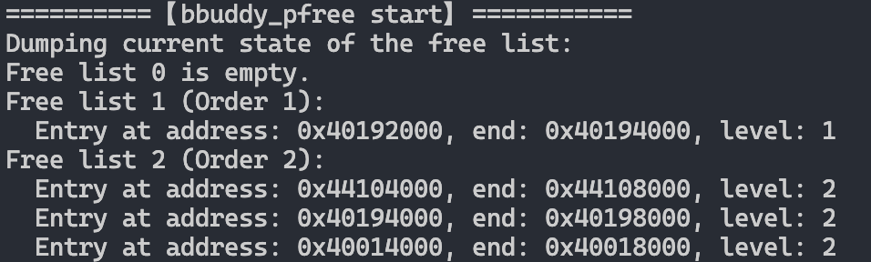
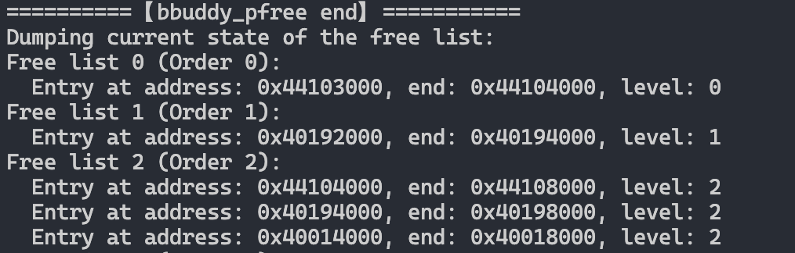

# Lab1 实验报告

[TOC]

## 1. 调试过程

### 1.1 alloc 之前

`main.c`  调用 `malloc` 函数，执行的是 `stdlib` 的 `malloc` 封装：

```c
void *malloc(size_t size)
{
	return uk_malloc(uk_alloc_get_default(), size);
}
```

其中 `uk_alloc_get_default` 直接返回了一个全局变量 `_uk_alloc_head` ，其类型是：

```c
struct uk_alloc {
  /* memory allocation */
  uk_alloc_malloc_func_t malloc;
  uk_alloc_calloc_func_t calloc;
  uk_alloc_realloc_func_t realloc;
  uk_alloc_posix_memalign_func_t posix_memalign;
  uk_alloc_memalign_func_t memalign;
  uk_alloc_free_func_t free;

#if CONFIG_LIBUKALLOC_IFMALLOC
  uk_alloc_free_func_t free_backend;
  uk_alloc_malloc_func_t malloc_backend;
#endif

  /* page allocation interface */
  uk_alloc_palloc_func_t palloc;
  uk_alloc_pfree_func_t pfree;
  uk_alloc_salloc_func_t salloc;
  uk_alloc_sfree_func_t sfree;
  /* optional interfaces, but recommended */
  uk_alloc_getsize_func_t maxalloc;   /* biggest alloc req. (bytes) */
  uk_alloc_getsize_func_t availmem;   /* total memory available (bytes) */
  uk_alloc_getpsize_func_t pmaxalloc; /* biggest alloc req. (pages) */
  uk_alloc_getpsize_func_t pavailmem; /* total pages available */
  /* optional interface */
  uk_alloc_addmem_func_t addmem;

#if CONFIG_LIBUKALLOC_IFSTATS
  struct uk_alloc_stats _stats;
#endif

  /* internal */
  struct uk_alloc *next;
  __u8 priv[];
};
```

其中存放很多内存管理函数指针，通用内存分配器接口。有意思的是 `internal` 部分。

- `struct uk_alloc *next` 说明 unikraft 中的内存分配器构成了一个链表，系统可以在启动时初始化多个内存分配器，串成链表方便管理。
- `__u8 priv[]` 是柔性数组成员，用于**放具体分配器实现的私有状态**。

那么分配器在哪里被初始化？

```c
int uk_alloc_register(struct uk_alloc *a) {
  struct uk_alloc *this = _uk_alloc_head;

  if (!_uk_alloc_head) {
    _uk_alloc_head = a;
    a->next = __NULL;
    return 0;
  }

  while (this && this->next) this = this->next;
  this->next = a;
  a->next = __NULL;
  return 0;
}
```

 每注册一个新的分配器，就将其挂在链表的最后。


`uk_alloc_get_default()` 返回的是第一个注册的分配器 `_uk_alloc_head`，打断点查看其具体实现：

```bash
(gdb) b alloc.c:67
Breakpoint 1 at 0x4011aa0c: file /root/OS-2026/app-helloworld/workdir/unikraft/lib/ukalloc/alloc.c, line 68.
(gdb) c
Continuing.

Breakpoint 1, uk_alloc_register (a=0x40010000) at /root/OS-2026/app-helloworld/workdir/unikraft/lib/ukalloc/alloc.c:68
68        struct uk_alloc *this = _uk_alloc_head;
(gdb) p *a
$2 = {malloc = 0x4011abbc <uk_malloc_ifpages>, 
  calloc = 0x4011b608 <uk_calloc_compat>, realloc = 0x4011aeb0 <uk_realloc_ifpages>, 
  posix_memalign = 0x4011b000 <uk_posix_memalign_ifpages>, 
  memalign = 0x4011b6f0 <uk_memalign_compat>, free = 0x4011ad24 <uk_free_ifpages>, 
  palloc = 0x4011c454 <bbuddy_palloc>, pfree = 0x4011c964 <bbuddy_pfree>, 
  salloc = 0x4011c760 <bbuddy_salloc>, sfree = 0x4011cc78 <bbuddy_sfree>, 
  maxalloc = 0x4011b240 <uk_alloc_maxalloc_ifpages>, 
  availmem = 0x4011b2f8 <uk_alloc_availmem_ifpages>, 
  pmaxalloc = 0x4011cedc <bbuddy_pmaxalloc>, 
  pavailmem = 0x4011cfc8 <bbuddy_pavailmem>, addmem = 0x4011d340 <bbuddy_addmem>, 
  next = 0x0, priv = 0x40010080 ""}
```

> 额外的，好奇其他分配器是什么：
>
> 第二和第三个，都是栈内存分配器：
>
> ```
> (gdb) p *a
> $3 = {malloc = 0x4012d4c0 <stack_malloc>, calloc = 0x4012da20 <stack_calloc>, 
>   realloc = 0x4011b518 <uk_realloc_compat>, 
>   posix_memalign = 0x4012d858 <stack_posix_memalign>, 
>   memalign = 0x4012d688 <stack_memalign>, free = 0x4012d5dc <stack_free>, 
>   palloc = 0x4011b460 <uk_palloc_compat>, pfree = 0x4011b388 <uk_pfree_compat>, 
>   salloc = 0x0, sfree = 0x0, maxalloc = 0x0, availmem = 0x0, pmaxalloc = 0x0, 
>   pavailmem = 0x0, addmem = 0x0, next = 0x0, priv = 0x44101fa0 ""}
> ```
>
> 只有 `priv` 的地址不一样。


回到主线，进一步调用 unikraft 的 `uk_malloc` 函数：

```c
static inline void *uk_malloc(struct uk_alloc *a, __sz size) {
  if (unlikely(!a)) {
    errno = ENOMEM;
    return __NULL;
  }
  return uk_do_malloc(a, size);
}
```

其中 `unlikely` 是一个分支预测优化宏： `#define unlikely(x) (__builtin_expect((!!(x)), 0))`，用于告诉编译器，`a` 为 `NULL` 的条件不太可能发生，让CPU更倾向于走非空的路径。

进一步执行 `uk_do_malloc` ：

```c
static inline void *uk_do_malloc(struct uk_alloc *a, __sz size) {
  UK_ASSERT(a);
  return a->malloc(a, size);
}
```

根据前面的分析（或者直接 gdb step into），`a->malloc` 的具体实现是 `uk_malloc_ifpages` 

```c
#define METADATA_IFPAGES_SIZE_POW2 32

void *uk_malloc_ifpages(struct uk_alloc *a, __sz size) {
  __uptr intptr;
  unsigned long num_pages;
  struct metadata_ifpages *metadata;
  __sz realsize = METADATA_IFPAGES_SIZE_POW2 + size; // 真实分配空间增加了32B

  if (IS_SMALL(realsize)) {
    num_pages = size_to_s_num_pages(realsize);
    intptr = (__uptr)uk_salloc(a, num_pages);
    uk_pr_err("alloc size => %llu, num_pages => %llu, intpter => %p\n",
              realsize, num_pages, intptr);
  } else {
    num_pages = size_to_num_pages(realsize);
    intptr = (__uptr)uk_palloc(a, num_pages);
  }

  if (!intptr) return __NULL;

  metadata = (struct metadata_ifpages *)intptr;
  metadata->size = size;
  metadata->num_pages = num_pages;
  metadata->base = (void *)intptr;

  return (void *)(intptr + METADATA_IFPAGES_SIZE_POW2);
#endif /* CONFIG_HAVE_MEMTAG */
}
```

比较有趣的是 `struct metadata_ifpages`，其中3个字段共 24B：

```c
struct metadata_ifpages {
  __sz size;               /* user size */
  unsigned long num_pages; /* alloc pages */
  void *base;
} __align_metadata_ifpages;
```

```
(gdb) p sizeof(struct metadata_ifpages)
$5 = 24
```

但是设置扩展32B，是为了保证地址按2的幂对齐，简化地址计算、提升系统在读取数据时的性能。


这一步出现了分支，根据分配的内存页面大小选择 `salloc` 或 `palloc`. 

如果分配的内存小于 4096 / 5 = 819B 字节，走 `salloc` ；否则走 `palloc`.

```c
#define IS_SMALL(size) ((size) < (__PAGE_SIZE / 5))
```

> 这里源代码注释有误，应该是20%不是50%。


### 1.2 分支1：palloc

如果请求的是大页面（如`size = 3072` ），执行：

```c
    num_pages = size_to_num_pages(realsize);
    intptr = (__uptr)uk_palloc(a, num_pages);
```

其中 `size_to_num_pages` 计算一个内存请求需要占多少页（整页数，向上取整）。`__PAGE_SIZE = 4096`

```
#define size_to_num_pages(size) \
  (PAGE_ALIGN_UP((unsigned long)(size)) / __PAGE_SIZE)
```


`uk_palloc` 的封装类似 `uk_malloc` ，不再赘述。最终将执行：

```
a->palloc(a, num_pages);
```

这里 `palloc` 的具体实现是 `bbuddy_palloc` 。分析见注释。

```c
static void *bbuddy_palloc(struct uk_alloc *a, unsigned long num_pages) {
  struct uk_bbpalloc *b;
  size_t i;
  chunk_head_t *alloc_ch, *spare_ch;
  chunk_tail_t *spare_ct;

  uk_pr_err("==========【bbuddy_palloc start】===========\n");
  uk_bbpalloc_dump_freelist(); // Debug，打印free list
  UK_ASSERT(a != NULL);
  b = (struct uk_bbpalloc *)&a->priv; // 拿到私有数据结构
  freelist_sanitycheck(b->free_head); 

  size_t order = (size_t)num_pages_to_order(num_pages); 
  // buddy 分配器的核心思想：内存按 2^k 页为单位管理。

  /* Find smallest order which can satisfy the request. */
  // 找到空闲队列里能满足需求的最小的order
  for (i = order; i < FREELIST_SIZE; i++) {
    if (!FREELIST_EMPTY(b->free_head[i])) break;
  }
  if (i >= FREELIST_SIZE) goto no_memory;

  /* Unlink a chunk. */
  // 拆分大块
  // 先取出一个满足条件的块
  alloc_ch = b->free_head[i];
  b->free_head[i] = alloc_ch->next;
  alloc_ch->next->pprev = alloc_ch->pprev;

  /* We may have to break the chunk a number of times. */
  // 如果拿到的块比需要的还大，就不断对半拆
  // 每拆一次: 左边继续保留给分配（alloc_ch），右边作为 spare chunk 放回较小的 freelist。
  while (i != order) {
    /* Split into two equal parts. */
    i--;
    spare_ch = (chunk_head_t *)((char *)alloc_ch + (1UL << (i + __PAGE_SHIFT)));
    spare_ct =
        (chunk_tail_t *)((char *)spare_ch + (1UL << (i + __PAGE_SHIFT))) - 1;

    /* Create new header for spare chunk. */
    spare_ch->level = i;
    spare_ch->next = b->free_head[i];
    spare_ch->pprev = &b->free_head[i];
    spare_ct->level = i;

    /* Link in the spare chunk. */
    spare_ch->next->pprev = &spare_ch->next;
    b->free_head[i] = spare_ch;
  }
  // 分配完之后对齐
  UK_ASSERT(FREELIST_ALIGNED(alloc_ch, order));
  // 更新位图
  map_alloc(b, (uintptr_t)alloc_ch, 1UL << order);

  uk_alloc_stats_count_palloc(a, (void *)alloc_ch, num_pages);
  freelist_sanitycheck(b->free_head);

  uk_pr_err("==========【bbuddy_palloc end】===========\n");
  uk_bbpalloc_dump_freelist();

  return ((void *)alloc_ch);

no_memory:
  uk_pr_warn(
      "%"__PRIuptr
      ": Cannot handle palloc request of order %"__PRIsz
      ": Out of memory\n",
      (uintptr_t)a, order);

  uk_alloc_stats_count_penomem(a, num_pages);
  errno = ENOMEM;
  return NULL;
}
```


### 1.3 分支2：salloc

```
num_pages = size_to_s_num_pages(realsize);
intptr = (__uptr)uk_salloc(a, num_pages);
```

其中 `size_to_s_num_pages` ，计算一个内存请求需要占多少小页（整页数，向上取整）。`__S_PAGE_SIZE = 128`

```c
#define size_to_s_num_pages(size) \
  (ALIGN_TO_S_PAGE_SIZE((unsigned long)(size)) / __S_PAGE_SIZE)
```

同上，最终进入到 `bbuddy_salloc` 。

细节上和 `palloc` 几乎一样，实现策略改为寻找连续的小页：

```c
  while (i < num_pages && (curr_ch->next != &b->s_free_tail[0])) {
    pred_ch = curr_ch;
    curr_ch = curr_ch->next;
    if ((unsigned long)curr_ch + __S_PAGE_SIZE != (unsigned long)pred_ch) {
      i = 0;
    }
    i += 1;
    // uk_pr_debug("curr 0x%016lx\n", curr_ch);
  }
```


### 1.4 free 之前<a id="大内存分配问题"></a>

与 `alloc` 类似，最终执行到 ` a->free(a, ptr);` 

但是这里出现了问题。`a` 的实现中，`free` 的函数指针指向的是 `uk_free_ifpages`：

```c
// 简化版本
void uk_free_ifpages(struct uk_alloc *a, void *ptr, const void *small) {
  struct metadata_ifpages *metadata;
  metadata = uk_get_metadata(ptr, small);

  if (small) {
    uk_sfree(a, metadata->base, metadata->num_pages);
  } else {
    uk_pfree(a, metadata->base, metadata->num_pages);
  }
}
```

发现 `a->free(a, ptr)` 只传了前两个参数，而 `uk_free_ifpages` 需要3个形参！

进入 `uk_free_ifpages` 后打印变量：

```c
(gdb) info args
a = 0x40010000
ptr = 0x44103020
small = 0x4011ad24 <uk_free_ifpages>
```

`small` 指向了 `uk_free_ifpages` 自己。

因为函数参数是从栈顶指针向下偏移获取的。调用函数压入参数之后就压入了函数本身的指针，所以解析到的small变成了指向自己的函数指针。

```
(gdb) x/32x $sp
0x4000fe60:     0x4000fea0      0x00000000      0x40111fe8      0x00000000
0x4000fe70:     0x00000c00      0x00000000      0x4011ad24      0x00000000
0x4000fe80:     0x44103020      0x00000000      0x40010000      0x00000000
```


函数指针肯定非空，所以一定进入 `uk_sfree` 分支。

可以强行设置 `small` 进入 `uk_pfree` 分支。

```
(gdb) set var small = (const void *)0
```


### 1.5 分支1：pfree

同前面的分析，最终进入 `bbuddy_pfree` 函数。不再赘述，只关注核心逻辑：

```c
while (order < FREELIST_SIZE) {
  mask = 1UL << (order + __PAGE_SHIFT);
  if ((unsigned long)freed_ch & mask) {
    // 找左 buddy
  } else {
    // 找右 buddy
  }

  // 如果 buddy 还在用，或者级别不对，就 break

  // 否则，从空闲链表中摘掉 buddy，和 freed_ch 合并成更大块
  order++;
}
```

- buddy 算法的关键：每次释放时，检查 **相邻的 buddy 块** 是否空闲、且大小一致。
- 如果能合并，就把 buddy 从 freelist 中拿掉，升级为更大一级的块。
- 不断循环，直到不能再合并或到达最大阶。

最终把块挂回 freelist ：

```c
freed_ch->level = order;
freed_ch->next = b->free_head[order];
freed_ch->pprev = &b->free_head[order];
freed_ct->level = order;

freed_ch->next->pprev = &freed_ch->next;
b->free_head[order] = freed_ch;
```

- 设置好块的级别（order）。
- 把它挂到对应大小的空闲链表里。

### 1.6 分支2：sfree

遍历插入 freelist

```c
chunk_head_t **current = &b->s_free_head[0];
chunk_head_t *prev = NULL;
```

- 从小页 freelist 的头开始，准备找到合适位置插入。
- current 指针遍历链表，prev 保存前一个节点。

构造新的 free chunk

```c
freed_ch = (chunk_head_t *)obj;
freed_ct = (chunk_tail_t *)((char *)obj + (1UL << __S_PAGE_SHIFT)) - 1;

freed_ch->level = 0;
freed_ct->level = 0;
```

找到插入点：

```
while (*current != NULL) {
  if ((uintptr_t)freed_ch > (uintptr_t)(*current)) {
    break;
  }
  prev = *current;
  current = &(*current)->next;
}
```

- 按地址顺序遍历 freelist，找到比当前块地址更大的位置，准备插入。
- 这样能保持空闲链表按地址递增排列。

插入到 freelist

```c
freed_ch->next = *current;
freed_ch->pprev = current;

if (*current != NULL)
  (*current)->pprev = &freed_ch->next;

*current = freed_ch;
```

- 把新释放的小页插到链表里。
- 更新前后指针（双向链表维护）。

每次只处理 1 个小页（128B），如果 `num_pages > 1`，就把 obj 移到下一个小页的起始位置，继续循环。

```
nr_page_left--;
obj = freed_ct + 1;
```


## 2. 内存分配大小分析

在调试过程中，通过观察内存状态，填写下表，记录不同请求大小对应的实际分配大小。

| 请求分配大小 | 实际分配大小 | 分析与说明                                                   |
| ------------ | ------------ | ------------------------------------------------------------ |
| 96 字节      | 128B         | 分配小内存，调用salloc<br>分配后少了0x44101a00~0x44101a80的一块内存 |
| 128 字节     | 256B         | 同上，少了2块128B的内存                                      |
| 256 字节     | 384B         | 同上，少了3块128B的内存                                      |
| 4064 字节    | 4KB          | 分配大内存，调用palloc<br>分配后少了一块Level1，多了一块Level0 |
| 4096 字节    | 8KB          | 同上，分配后少了一块Level1                                   |


96B 的测试说明，Unikraft 的内存最小分配单元式 128B。

但是分配128B空间时，实际上分配了2块最小内存单元。

这是因为分配内存空间时额外分配了 32B 用于存放 metadata。

关键部分代码（注释补充说明）：

```c
#define METADATA_IFPAGES_SIZE_POW2 32

void *uk_malloc_ifpages(struct uk_alloc *a, __sz size) {
  __uptr intptr;
  unsigned long num_pages;
  struct metadata_ifpages *metadata;
  __sz realsize = METADATA_IFPAGES_SIZE_POW2 + size; // 真实分配空间增加了32B

  // 判断size是否小于50%的页面大小，如果小于就使用salloc进行分配，否则使用palloc
  if (IS_SMALL(realsize)) {
    num_pages = size_to_s_num_pages(realsize);
    intptr = (__uptr)uk_salloc(a, num_pages);
    uk_pr_err("alloc size => %llu, num_pages => %llu, intpter => %p\n",
              realsize, num_pages, intptr);
  } else {
    num_pages = size_to_num_pages(realsize);
    intptr = (__uptr)uk_palloc(a, num_pages);
  }

  if (!intptr) return __NULL;

  metadata = (struct metadata_ifpages *)intptr;
  metadata->size = size;
  metadata->num_pages = num_pages;
  metadata->base = (void *)intptr;

  return (void *)(intptr + METADATA_IFPAGES_SIZE_POW2);
#endif /* CONFIG_HAVE_MEMTAG */
}
```

比较有趣的是 `struct metadata_ifpages`，其中3个字段共 24B：

```c
struct metadata_ifpages {
  __sz size;               /* user size */
  unsigned long num_pages; /* alloc pages */
  void *base;
} __align_metadata_ifpages;
```

```
(gdb) p sizeof(struct metadata_ifpages)
$5 = 24
```

但是设置扩展32B，保证地址按2的幂对齐，简化地址计算、提升系统在读取数据时的性能。


## 3. 核心问题

### 2.1 最小分配单元

> **最小分配单元**: Unikraft 两种内存分配策略的最小单元是多少？它是如何定义的？

#### 1. Buddy(palloc)

- **最小单元 = 1 个页 (page)**

- ```c
    #define __PAGE_SHIFT		12
    #define __PAGE_SIZE		(1 << __PAGE_SHIFT)
    ```

- 在代码里，buddy 的阶数（order）是按 **页数的 2^k** 来划分的：

    - order = 0 → 1 页 (4KB)
    - order = 1 → 2 页 (8KB)
    - order = 2 → 4 页 (16KB) …

- 所以 palloc 的最小分配单元是 1 页 (4KB)，不满一页会向上取整。

#### 2. Slab(salloc)

- **最小单元 = 1 个小页 (S-page)**

- ```c
    #define __S_PAGE_SHIFT 7
    #define __S_PAGE_SIZE (1ULL << __S_PAGE_SHIFT)
    ```

- 所以 salloc 的分配单位是 **128B **。

    

### 2.2 分配器选择

> **分配器选择**: `uk_malloc()` 函数在何种条件下会选择 `palloc`，又在何种条件下会选择`salloc`？

核心代码：

```c
#define IS_SMALL(size) ((size) < (__PAGE_SIZE / 5))
  if (IS_SMALL(realsize)) {
    num_pages = size_to_s_num_pages(realsize);
    intptr = (__uptr)uk_salloc(a, num_pages);
  } else {
    num_pages = size_to_num_pages(realsize);
    intptr = (__uptr)uk_palloc(a, num_pages);
  }
```

简要说明：

当实际分配的内存大小(`realsize = size + 32B`) 小于五分之一页，选择 `salloc`，否则选择 `palloc`。


### 2.3 大内存分配问题

详细原因和调试过程已在 [调试过程1.4](#大内存分配问题) 中说明。

使用 gdb 强行设置 `small` 让代码进入 `pfree` ，命令行中可以看到正确释放空间后的freelist





