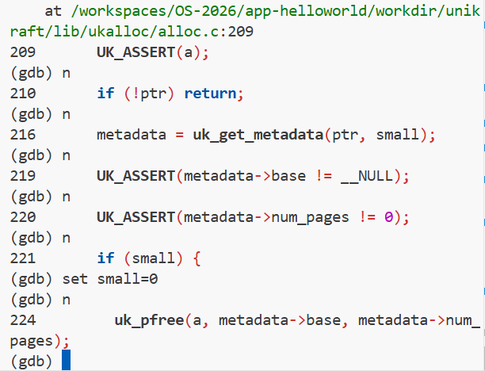

# 实验一：Unikraft 内存分配策略分析

## 实验目标

本实验旨在通过 `qemu` 和 `gdb` 调试 Unikraft 内核，深入分析其内存分配过程。你需要：
1.  跟踪不同大小内存请求的分配流程。
2.  分析当前 Buddy 和 Slab 分配器的协作机制。
3.  找出当前内存分配策略 / 协作机制中可能存在的不合理之处，例如内存碎片或正确性问题。
4.  将你的分析和调试过程记录下来，形成一份完整的实验报告。

## 任务与思考题

### 1. 内存分配大小分析

在调试过程中，通过观察内存状态，填写下表，记录不同请求大小对应的实际分配大小。

| 请求分配大小 | 实际分配大小 | 分析与说明 |
| :------- | :------ | :--------- |
| 96 字节   |    1*128     |    salloc 分配1页        |
| 128 字节  |    2*128     |    salloc 分配2页        |
| 256 字节  |    3*128     |    salloc 分配3页        |
| 4064 字节 |    1*4096     |   palloc 分配1页         |
| 4096 字节 |    2*4096     |   palloc 分配2页         |

### 2. 核心问题

请在报告中回答以下问题：

1.  **最小分配单元**: Unikraft 两种内存分配策略的最小单元是多少？它是如何定义的？
答：分别是1ULL<<12 4096与  1ULL<<7 128
通过宏定义：limits.h
#define __S_PAGE_SHIFT 7
#define __S_PAGE_SIZE (1ULL << __S_PAGE_SHIFT)
#define __PAGE_SHIFT  12
2.  **分配器选择**: `uk_malloc()` 函数在何种条件下会选择 `palloc`，又在何种条件下会选择`salloc`？
答：alloc.c:177
判断size是否小于50%的页面大小，如果小于则使用salloc进行分配，否则使用palloc
3.  **大内存分配问题**: 当前 `palloc` 在处理大内存（例如，一次性分配多个页面）的分配与回收时，存在一个已知的设计问题。请定位该问题，并尝试在 GDB 中通过 `set` 命令修改相关变量，模拟正确的 `free` 过程，并截图记录结果。
答：于alloc.c:221处，small为指针类型变量，不能发挥布尔值的作用。一般来讲，它都会发挥真值的作用。若要使分支进入否，需要通过set修改其值。截图如下：
