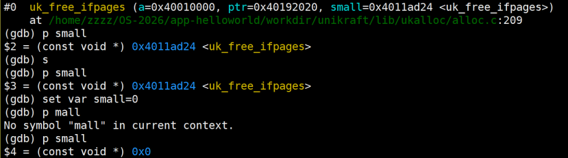

|         |         |                    |
| ------- | ------- | ------------------ |
| 请求分配的大小 | 实际分配的大小 | 分析说明               |
| 96字节    | 128B    | 96+32=128,要1个小页    |
| 128字节   | 2*128B  | 128+32>128,要2个小页   |
| 256字节   | 3*128B  | 256+32>2*128,要3个小页 |
| 4064字节  | 4KB     | 4064+32=4K,只需要一个页  |
| 4096字节  | 8KB     | 4096+32>4K,要分配两个页  |

Unikcraft两种内存分配策略：

1. 伙伴算法：最小分配大小为4KB，大小由宏定义__PAGE_SIZE定义

2. Slab分配策略：最小分配大小128B，大小由宏定义__S_PAGE_SIZE定义

当realsize小于伙伴算法基本单元的50%时使用salloc，否则用palloc

Uk_free_ifpages函数中通过small指针来判断是使用uk_sfree还是uk_pfree,但是small指针始终是非NULL的导致始终执行sfree，可以修改small的值来让程序执行pfree

