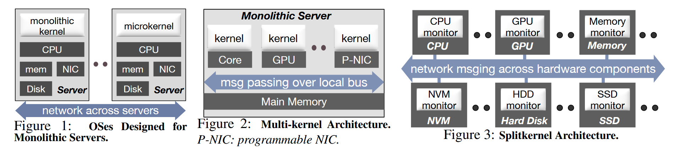
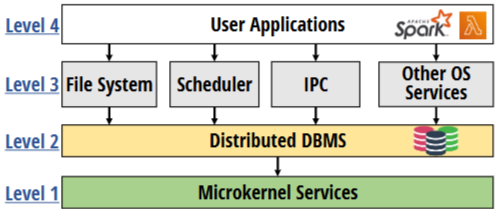
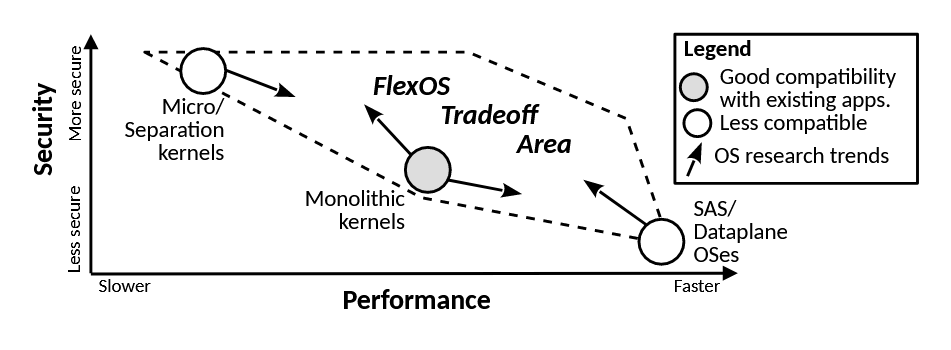

## LegoOS, 2018

想解决什么问题：
将单片(monolithic)服务器拆分为多个分离的、网络连接的部件是趋势，但还没有操作系统或者系统软件能够很好的管理各部分的资源。

这个问题为什么重要：
数据中心现在的monolithic server面临多种问题  
1. 一个进程只能使用同一台机器上的处理器和存储器，CPU和memory的利用率低  
2. 当硬件设备打包好组成服务器后，数据中心很难再添加，移除和修改硬件设备  
3. 一个硬件设备故障会导致整个服务器故障
4.  数据中心有很多异构的硬件设备，在monolithic server上适配和部署这些异构硬件设备很困难
因此数据中心需要将monolithic server拆成多个分离的部件并分布式管理，但还没有能够管理这些分离式资源的操作系统。

现在有什么解决方法，论文的解决方法和他们有什么不同：
1. 现有的解决办法：目前没有很好的解决办法，目前的操作系统内核还不能解决硬件资源分离带来的挑战，比如在分离的硬件资源之间的网络通信开销、资源管理和容错能力，因为现有的内核假设共享内存、存储设备、网络接口和其他硬件资源都是能够本地访问的
2. 论文的解决方法：
	1. 提出了叫做splitkernel的OS架构，splitkernel会把操作系统的功能和其所需的硬件分离，每个部分使用一个monitor进行管理，monitors是异构的，能够在不影响系统其他部件的情况下方便得动态添加，移除和重启自己管理的部分，每个monitor之间通过网络通信
	2. 基于splitkernel架构构建了LegoOS操作系统，它能够运行在分离式硬件集群上并管理这些硬件
	

论文的主要贡献：
1. 提出splitkernel架构
2. 构建了LegoOS操作系统
3. 提出了一个新的硬件架构，该架构能够清晰的分类处理器和内存的功能同时保留monolithic server architecture的大部分性能

缺陷：
1. 因为没有提供高效的本地缓存机制或一致性机制，在多个线程同时运行时容易频繁访问内存，但内存和处理器是分离的，但是容易受到网络影响造成瓶颈。因此同时运行的线程数量对应用的吞吐量影响很大。
2. 目前还不支持数据在多个内存部件之间迁移，只能在分配的时候尽可能均衡分配，所以会导致部分内存部件过载而部分却空闲，从而对性能产生影响。

未来展望：
实现内存部件之间的数据迁移

## DBOS

想解决什么问题：
DBOS旨在解决传统操作系统架构无法适应现代大规模分布式计算环境的根本性问题。随着企业服务器拥有数百核心、TB级内存和PB级存储，以及云计算的普及，现有操作系统（如Unix/Linux）已无法有效管理这些资源。

这个问题为什么重要：
现代计算环境的规模和复杂性已经使系统管理本身成为"大数据"问题。当前操作系统架构无法提供有效的资源管理、任务调度和跨节点通信能力，导致开发和维护分布式应用变得异常复杂。同时，新兴应用（如机器学习、IoT、大数据）对系统提出了新的需求，而现有操作系统架构缺乏对这些需求的支持，特别是缺乏数据溯源功能，这在政策合规和数据调试中越来越重要。

现在有什么解决方法，论文的解决方法和他们有什么不同：
现有解决方法是采用"单节点操作系统+独立集群调度器+分布式文件系统+网络管理器"的分层架构。这种架构导致多层之间集成度低，跨切面问题（如数据溯源、监控、安全、调试）难以解决，需要定制化解决方案。

DBOS的解决方法则从根本上重构了操作系统架构：将分布式事务型数据库管理系统(DBMS)作为整个集群操作系统的基石。DBOS提出"everything is a table"的抽象，将所有OS状态表示为关系表，利用现代DBMS技术扩展OS功能。这种架构使OS服务（调度、文件管理、IPC等）通过标准数据库查询实现，而不是通过传统OS系统调用。

论文的主要贡献：
1. 提出了一种全新的操作系统架构，将DBMS作为OS的核心，而非附加组件
2. 通过将OS服务实现为标准数据库查询，显著降低了代码复杂性
3. 为分布式应用提供了更好的监控、调试和安全能力，通过SQL查询OS状态
4. 提出了一种四层架构（用户空间、OS功能层、DBMS层、微内核服务层），为构建下一代操作系统提供蓝图

缺陷：
1. DBOS不支持复杂的内存管理功能，依赖DBMS自身进行内存管理，这可能限制了某些特定应用场景
2.  依赖DBMS的性能和可靠性，如果DBMS出现故障，整个OS可能受到影响
3. DBOS可能无法完全替代Linux的某些功能，特别是需要精细控制的场景
4. 对于需要直接硬件访问的场景，DBOS架构可能不如传统OS灵活

未来展望：
1. 优化DBMS与OS服务的集成，提高性能和可扩展性
2. 支持更复杂的分析和监控功能，利用DBMS的分析能力
3. 探索DBOS在边缘计算、物联网等新兴场景的应用

## FlexOS

想解决什么问题：
现有的操作系统设计方案, 包括安全策略以及隔离策略等, 都是在设计时就确定好的, 在设计完成后就很难更改了。

这个问题为什么重要：
这种僵硬的safety primitives给现代操作系统带来了一些问题
1. 现代的应用程序有多种多样的安全和性能需求，而这种safety primitives无法实现对每个应用的OS定制化
2. 现在有很多的隔离机制，当多个隔离机制可以使用在用一个task中时，理想情况下，我们应该需要找出最适合这个task的隔离机制，这往往需要等到部署时才能有足够的信息来选择隔离机制

现在有什么解决方法，论文的解决方法和他们有什么不同：

论文的主要贡献：
1. 提出了FlexOS，一种基于LibOS模块化的设计方式，能够在构建时期对特定的应用定制隔离和保护机制的配置文件。
2. 提出一种半自动化技术partial safety ordering，该技术使用partially ordered sets来描述FlexOS配置的安全程度并能够在给定的性能需求下找出最安全的配置方式

