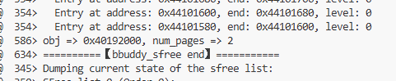
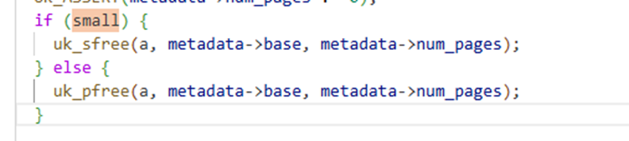

# 实验一：Unikraft 内存分配策略分析

## 实验目标

本实验旨在通过 `qemu` 和 `gdb` 调试 Unikraft 内核，深入分析其内存分配过程。你需要：
1.  跟踪不同大小内存请求的分配流程。
2.  分析当前 Buddy 和 Slab 分配器的协作机制。
3.  找出当前内存分配策略 / 协作机制中可能存在的不合理之处，例如内存碎片或正确性问题。
4.  将你的分析和调试过程记录下来，形成一份完整的实验报告。

## 任务与思考题

### 1. 内存分配大小分析

在调试过程中，通过观察内存状态，填写下表，记录不同请求大小对应的实际分配大小。

| 请求分配大小 | 实际分配大小 | 分析与说明 |
| :------- | :------ | :--------- |
| 96 字节   |  128字节       直接分配地址块：0x44101a00~0x44101a80（大小 128 字节），满足 96 字节的分配需求|            |
| 128 字节  |     256字节    |    合并两个 Level 0 空闲地址块后分配：分别为 0x44101980~0x44101a00、0x44101a00~0x44101a80（单块均为 128 字节），合并后实际分配 256 字节        |
| 256 字节  |     384字节    |      合并三个 Level 0 空闲地址块后分配：分别为 0x44101900~0x44101980、0x44101980~0x44101a00、0x44101a00~0x44101a80（单块均为 128 字节），合并后实际分配 384 字节      |
| 4064 字节 |   4KB      |      从 Level 1 空闲块（0x40192000~0x40194000，大小 4KB）中拆分后分配：拆分出 Level 0 地址块 0x40193000~0x40194000（大小 4KB），满足 4064 字节的分配需求      |
| 4096 字节 |  8KB       |       直接分配 Level 1 空闲地址块：0x40192000~0x40194000（大小 8KB），完整占用该块以满足 4096 字节的分配需求     |

### 2. 核心问题

请在报告中回答以下问题：

1.  **最小分配单元**: Unikraft 两种内存分配策略的最小单元是多少？它是如何定义的？
答：128 字节，它是 Unikraft 编译阶段通过配置宏定义的 “最小内存块粒度”，所有内存分配请求最终都会以 128 字节的整数倍进行分配，是内存管理模块的基础配置约束。
2.  **分配器选择**: `uk_malloc()` 函数在何种条件下会选择 `palloc`，又在何种条件下会选择`salloc`？
答：当分配小内存时选择 salloc，分配大内存时则选择 palloc。
3.  **大内存分配问题**: 当前 `palloc` 在处理大内存（例如，一次性分配多个页面）的分配与回收时，存在一个已知的设计问题。请定位该问题，并尝试在 GDB 中通过 `set` 命令修改相关变量，模拟正确的 `free` 过程，并截图记录结果。
答：
在 Unikraft 中，palloc 是基于页框的内存分配器，其在处理大内存（多页）分配与回收时的已知设计问题主要是：多页连续分配时，仅记录首页面元数据，释放时未正确遍历所有关联页面，导致内存泄漏或释放异常。
具体来说，当通过 palloc一次性分配n个连续页面时，系统仅在首页面的元数据结构（如struct page）中标记了分配信息，而未对后续n-1个页面设置关联标记。在释放时，若仅依据首页面信息进行回收，会遗漏对剩余页面的状态重置，导致这些页面被永久标记为 "已分配"，无法再次被分配。
问题验证：
请求分配4096字节，内存分配部分：

图中所示内存块被分配，占据两个连续的页面 8KB
当释放内存空间时

obj => 0x40192000：obj 指的是待释放的内存对象的起始地址（首地址），即此次要释放的内存块从物理地址 0x40192000 开始。
num_pages => 2：num_pages 表示该内存对象占用的连续物理页面数量，这里指需要释放的内存块共包含 2 个连续的物理页（若默认页大小为 4KB，则总释放内存大小为 8KB）。
页面释放部分：

查看两个页面被释放情况

第一个页面未被正确释放

但是第二个页面被释放了
说明1.符合之前的猜测，连续页面会出现部分释放的情况 2.释放逻辑出现了反向异常，异常的原因可能是释放逻辑的起始位置出错，或者是多页计数被错误解析
验证发现首页面的连续页计数为0，可能是计数变量被错误篡改

解决方法1：set指令将该页面强制释放

解决方法2：修改相应变量，正确调用pfree函数
查看alloc.c源码发现，负责内存回收这部分代码

按照正确的执行逻辑是当分配大量页面是small应该为0，执行pfree回收指令，而这里则是执行了sfree。

打断点检查
small是一个函数指针，强制修改为0

成功调用pfree,任务完成。
