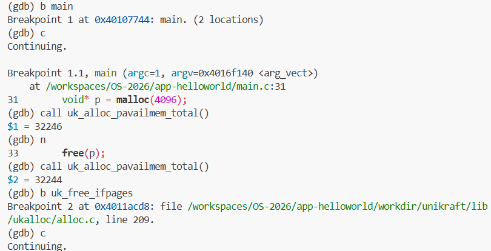
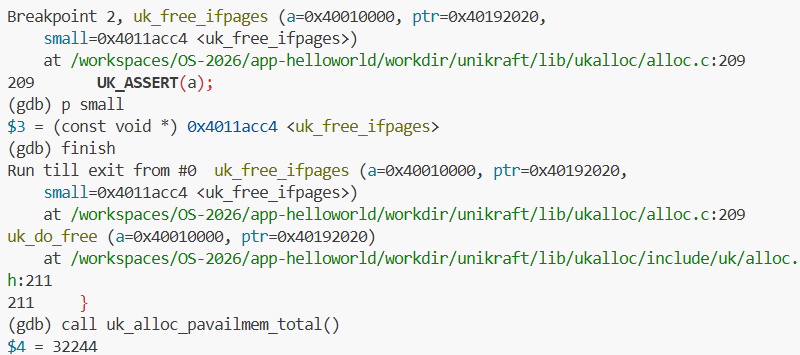
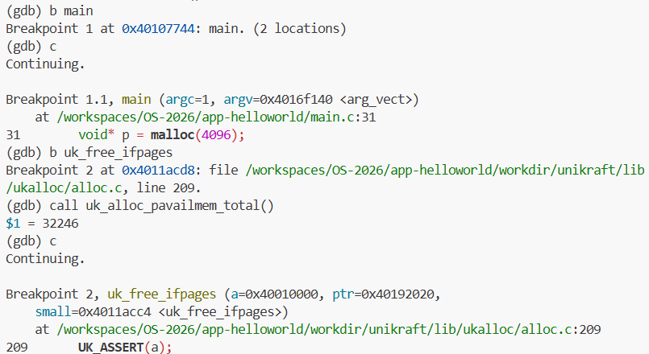
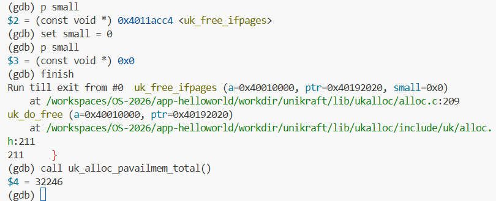

# 实验一：Unikraft 内存分配策略分析

## 实验目标

本实验旨在通过 `qemu` 和 `gdb` 调试 Unikraft 内核，深入分析其内存分配过程。你需要：
1.  跟踪不同大小内存请求的分配流程。
2.  分析当前 Buddy 和 Slab 分配器的协作机制。
3.  找出当前内存分配策略 / 协作机制中可能存在的不合理之处，例如内存碎片或正确性问题。
4.  将你的分析和调试过程记录下来，形成一份完整的实验报告。

## 任务与思考题

### 1. 内存分配大小分析

在调试过程中，通过观察内存状态，填写下表，记录不同请求大小对应的实际分配大小。

| 请求分配大小 | 实际分配大小 | 分析与说明 |
| :------- | :------ | :--------- |
| 96 字节   | 128字节  |  salloc来进行分配，96B+metadata(32B)=128B,恰好为一个slab最小块(128B)的大小  |
| 128 字节  | 256字节  |  salloc来进行分配，实际要使用160B，所以要分配两个slab的最小块  |
| 256 字节  | 384字节  |  salloc来进行分配，实际要使用288B，所以要分配三个slab的最小块  |
| 4064 字节 | 4096字节 |  palloc来进行分配，实际要使用4096B，恰好为palloc分配一个页的大小，所以分配一个页  |
| 4096 字节 | 8192字节 |  palloc来进行分配，实际要使用4128B，因此需要palloc分配两个最小页  |

### 2. 核心问题

请在报告中回答以下问题：

1. **最小分配单元**: Unikraft 两种内存分配策略的最小单元是多少？它是如何定义的？

在alloc.c中可以看到两种定义：
一种是
#define __S_PAGE_SHIFT 7
#define __S_PAGE_SIZE (1ULL << __S_PAGE_SHIFT)
这是salloc中分配的最小单元，也就是2^7B=128B
另一种是
__PAGE_SIZE，即系统页大小4KB

2. **分配器选择**: `uk_malloc()` 函数在何种条件下会选择 `palloc`，又在何种条件下会选择`salloc`？

在alloc.c中的uk_malloc_ifpages函数中：
if (IS_SMALL(realsize)) {
    num_pages = size_to_s_num_pages(realsize);
    intptr = (__uptr)uk_salloc(a, num_pages);
    uk_pr_err("alloc size => %llu, num_pages => %llu, intpter => %p\n",
              realsize, num_pages, intptr);
  } else {
    num_pages = size_to_num_pages(realsize);
    intptr = (__uptr)uk_palloc(a, num_pages);
  }
其中
#define IS_SMALL(size) ((size) < (__PAGE_SIZE / 5))
也就是(请求大小 + 32B) < PAGE_SIZE/5（约 < 819B）时使用 salloc，否则使用 palloc

3. **大内存分配问题**: 当前 `palloc` 在处理大内存（例如，一次性分配多个页面）的分配与回收时，存在一个已知的设计问题。请定位该问题，并尝试在 GDB 中通过 `set` 命令修改相关变量，模拟正确的 `free` 过程，并截图记录结果。

在 Unikraft 的 alloc.c 中，统一的释放接口定义如下：
void uk_free_ifpages(struct uk_alloc *a, void *ptr, const void *small);
而在内存分配器结构体中，释放函数指针定义为：
typedef void (*uk_alloc_free_func_t)(struct uk_alloc *a, void *ptr);
(a)->free = uk_free_ifpages;
因此，实际调用时仅传入两个参数 (a, ptr)，而函数实现需要三个参数 (a, ptr, small)。参数small得不到正确参数，small非0不能正确释放由palloc分配的页。

通过set small = 0将 small 置为0，从而实现让函数进入palloc分配内存释放的分支。

