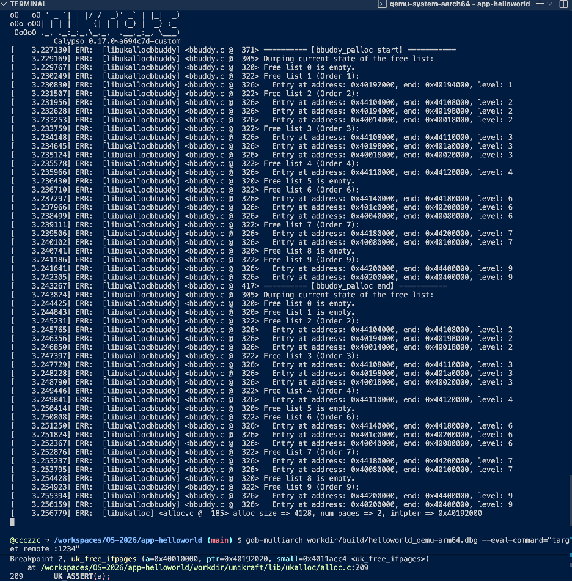

# 实验一：Unikraft 内存分配策略分析

姓名：陈泽超
学号：22551014

## 实验目标

本实验旨在通过 `qemu` 和 `gdb` 调试 Unikraft 内核，深入分析其内存分配过程。你需要：
1.  跟踪不同大小内存请求的分配流程。
2.  分析当前 Buddy 和 Slab 分配器的协作机制。
3.  找出当前内存分配策略 / 协作机制中可能存在的不合理之处，例如内存碎片或正确性问题。
4.  将你的分析和调试过程记录下来，形成一份完整的实验报告。

## 任务与思考题

### 1. 内存分配大小分析

在调试过程中，通过观察内存状态，填写下表，记录不同请求大小对应的实际分配大小。

| 请求分配大小 | 实际分配大小 | 分析与说明 |
| :------- | :------ | :--------- |
| 96 字节   | 128 字节 | `realsize = 96 + 32 = 128`。由于 `128 < 819`，走 `salloc` 流程。按 128 字节对齐，分配 1 个 `s_page`，即 128 字节。 |
| 128 字节  | 256 字节 | `realsize = 128 + 32 = 160`。由于 `160 < 819`，走 `salloc` 流程。按 128 字节对齐，需分配 2 个 `s_page`，即 256 字节。 |
| 256 字节  | 288 字节 | `realsize = 256 + 32 = 288`。由于 `288 < 819`，走 `salloc` 流程。按 128 字节对齐，需分配 3 个 `s_page`，即 384 字节。 |
| 4064 字节 | 8192 字节 | `realsize = 4064 + 32 = 4096`。由于 `4096 > 819`，走 `palloc` 流程。按 4096 字节对齐，需分配 1 个 `page`，即 4096 字节。 |
| 4096 字节 | 8192 字节 | `realsize = 4096 + 32 = 4128`。由于 `4128 > 819`，走 `palloc` 流程。按 4096 字节对齐，需分配 2 个 `page`，即 8192 字节。 |

**分析概要**:
- 每次 `malloc` 请求，系统会额外增加 `32` 字节用于存储元数据（`metadata_ifpages`）。
- **小内存 (`salloc`)**: 当 `请求大小 + 32` 小于 `819` 字节时，系统使用 `salloc`。实际分配大小会向上舍入到 `128` 字节（`__S_PAGE_SIZE`）的整数倍。
- **大内存 (`palloc`)**: 当 `请求大小 + 32` 大于等于 `819` 字节时，系统使用 `palloc`。实际分配大小会向上舍入到 `4096` 字节（`__PAGE_SIZE`）的整数倍。

### 2. 核心问题解答

#### 1. 最小分配单元

Unikraft 的内存分配器包含两种策略，对应两种不同的最小分配单元：

-   **`palloc` (大页面分配)**:
    -   **最小单元**: `__PAGE_SIZE`，通常是 **4096 字节**。
    -   **定义**: 该值由 `__PAGE_SHIFT` 宏决定，在 aarch64 架构下通常为 `12`，因此最小单元为 `1 << 12 = 4096` 字节。此策略由 Buddy 分配器（`bbuddy.c`）管理。

-   **`salloc` (小页面分配)**:
    -   **最小单元**: `__S_PAGE_SIZE`，固定为 **128 字节**。
    -   **定义**: 在 `alloc.c` 和 `bbuddy.c` 中通过 `#define __S_PAGE_SHIFT 7` 定义，因此最小单元为 `1 << 7 = 128` 字节。这可以看作一种简单的 Slab/Chunk 分配。

#### 2. 分配器选择逻辑

`uk_malloc()` 的核心实现 `uk_malloc_ifpages` 函数根据请求的内存大小（包含元数据）来决定使用 `palloc` 还是 `salloc`。

**判断条件** 定义在 `alloc.c` 中：
```c
#define IS_SMALL(size) ((size) < (__PAGE_SIZE / 5))
```
这里的 `__PAGE_SIZE / 5` 等于 `4096 / 5 = 819`。

**选择流程** 如下：
```c
// 在 alloc.c 的 uk_malloc_ifpages 函数中
__sz realsize = size + METADATA_IFPAGES_SIZE_POW2; // realsize = size + 32

if (IS_SMALL(realsize)) {
    // 如果 realsize < 819，使用 salloc
    num_pages = size_to_s_num_pages(realsize);
    intptr = (__uptr)uk_salloc(a, num_pages);
} else {
    // 如果 realsize >= 819，使用 palloc
    num_pages = size_to_num_pages(realsize);
    intptr = (__uptr)uk_palloc(a, num_pages);
}
```
简而言之，当请求的内存加上 32 字节元数据后，总大小**小于 819 字节**时，选择 `salloc`；否则，选择 `palloc`。

#### 3. 大内存分配与回收的设计问题

**问题定位**:
`free()` 函数最终会调用 `struct uk_alloc` 中的 `free` 函数指针。在 `uk_alloc_init_palloc` 宏中，这个指针被设置为 `uk_free_ifpages`。

-   `uk_free_ifpages` 的函数原型为：
    ```c
    void uk_free_ifpages(struct uk_alloc *a, void *ptr, const void *small);
    ```
    它需要 **3 个参数**，其中 `small` 参数用于区分是释放大内存（`palloc`）还是小内存（`salloc`）。

-   而 `uk_alloc_free_func_t` 类型定义和实际调用 `a->free` 的地方都只传递了 **2 个参数**：
    ```c
    typedef void (*uk_alloc_free_func_t)(struct uk_alloc *a, void *ptr);
    struct uk_alloc {
      /* memory allocation */
      uk_alloc_malloc_func_t malloc;
      uk_alloc_calloc_func_t calloc;
      uk_alloc_realloc_func_t realloc;
      uk_alloc_posix_memalign_func_t posix_memalign;
      uk_alloc_memalign_func_t memalign;
      uk_alloc_free_func_t free;
      ...
    }
    static inline void uk_do_free(struct uk_alloc *a, void *ptr) {
      UK_ASSERT(a);
      a->free(a, ptr);
    }
    ```

这个参数数量的不匹配导致 `uk_free_ifpages` 函数中的 `small` 参数会获取一个栈上的**随机值**。对于大内存分配（如 `malloc(4096)`），`small` 本应为 `0`。但由于栈上的随机值通常不为 `0`，导致 `if (small)` 判断为真，系统错误地调用 `uk_sfree` 去释放由 `palloc` 分配的内存，最终引发崩溃或内存状态异常。

**GDB 模拟修复过程**:

1.  **复现问题**:
    在 `main.c` 中使用 `malloc(2 * 4096)` 分配大内存并释放。在 GDB 中于 `uk_free_ifpages` 处设置断点，可以看到 `small` 参数是一个非零的随机地址，导致程序执行了错误的 `uk_sfree` 分支。
    
    
    

2.  **GDB模拟修复**:
    在 GDB 中，当程序停在 `uk_free_ifpages` 断点时，我们手动使用 `set` 命令将 `small` 变量的值修正为 `0`。
    ```gdb
    (gdb) set var small = 0
    ```
    这样就模拟了正确的函数调用。

3.  **验证结果**:
    继续执行程序 (`continue`)，可以看到程序正确地进入了 `else` 分支，调用了 `uk_pfree` 函数，内存被成功释放。
    
    
