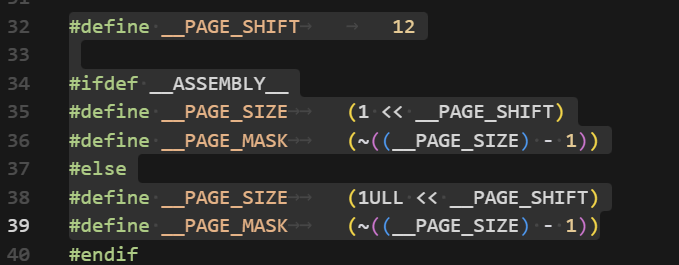
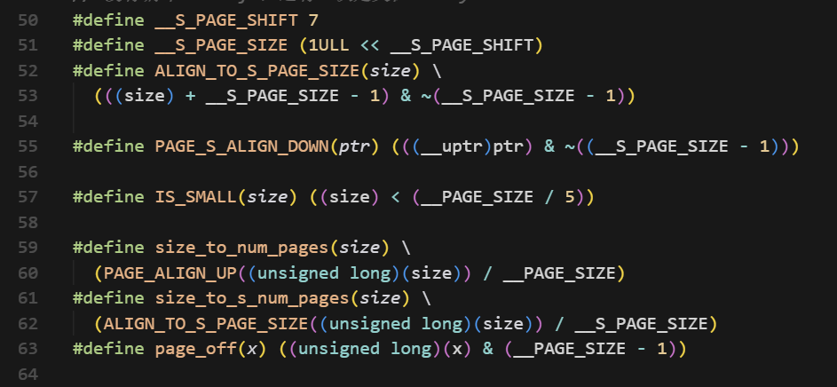

### 1. 内存分配大小分析

在调试过程中，通过观察内存状态，填写下表，记录不同请求大小对应的实际分配大小。

| 请求分配大小 | 实际分配大小 | 分析与说明 |
| :------- | :------ | :--------- |
| 96 字节   | 128B    | 96B + 32B = 128B，小内存，向上取整分配 128B×1 |
| 128 字节  | 256B    | 128B + 32B = 160B，小内存，向上取整分配 128B×2 |
| 256 字节  | 384B    | 256B + 32B = 288B，小内存，向上取整分配 128B×3 |
| 4064 字节 | 4096B   | 4064B + 32B = 4096B，大内存，向上取整分配 4096B×1 |
| 4096 字节 | 8192B   | 4096B + 32B = 4128B，大内存，向上取整分配 4096B×2  |

### 2. 核心问题

请在报告中回答以下问题：

1.  **最小分配单元**: Unikraft 两种内存分配策略的最小单元是多少？它是如何定义的？

页级分配使用 Unikraft 的页为最小分配单元，页大小由体系结构头文件通过 __PAGE_SHIFT 定义，当前配置下为 1 << 12 = 4096 字节

小对象分配使用“子页”作为最小单元，这个子页大小在 bbuddy.c 中通过 __S_PAGE_SHIFT 固定为 1 << 7 = 128 字节，用来细分单个页并服务小块请求。
2.  **分配器选择**: `uk_malloc()` 函数在何种条件下会选择 `palloc`，又在何种条件下会选择`salloc`？
uk_malloc() 实际调用默认分配器里注册的 uk_malloc_ifpages()，该函数会先把用户请求加上 32 B 元数据得到 realsize，再判断 IS_SMALL(realsize) 是否成立。

当 realsize < __PAGE_SIZE / 5（4 KB 页面的 1/5，大约 819 B）时视为“小块”，分配器计算 128 B（__S_PAGE_SIZE）子页的个数并调用 uk_salloc()；这就是选择 salloc 的条件。
当 realsize ≥ __PAGE_SIZE / 5 时，则按整页对齐计算页数，通过 uk_palloc() 直接拿整页；这是选择 palloc 的条件。

3.  **大内存分配问题**: 当前 `palloc` 在处理大内存（例如，一次性分配多个页面）的分配与回收时，存在一个已知的设计问题。请定位该问题，并尝试在 GDB 中通过 `set` 命令修改相关变量，模拟正确的 `free` 过程，并截图记录结果。
uk_free_ifpages是 Unikraft 内存分配库（ukalloc）中负责页面级内存释放的函数。问题出在其对 “小内存” 和 “大内存（页面级）” 的判断逻辑中，变量small的取值错误地影响了大内存的释放流程。

先在main函数断点，执行到malloc(4096)
再在uk_free_ifpages函数断点，此时进入内存释放逻辑
通过set var small=0强制修改small变量的值。这个变量原本的取值会错误地将 “大内存释放” 判定为 “小内存释放”，导致流程异常。将其设为0后，触发了正确的大内存释放逻辑。
执行continue后，程序正常退出（[Inferior 1 (process 1) exited normally]），说明大内存释放流程被正确模拟。