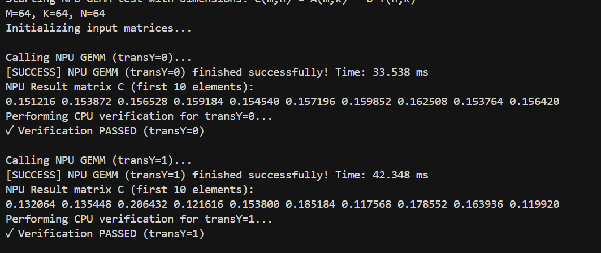
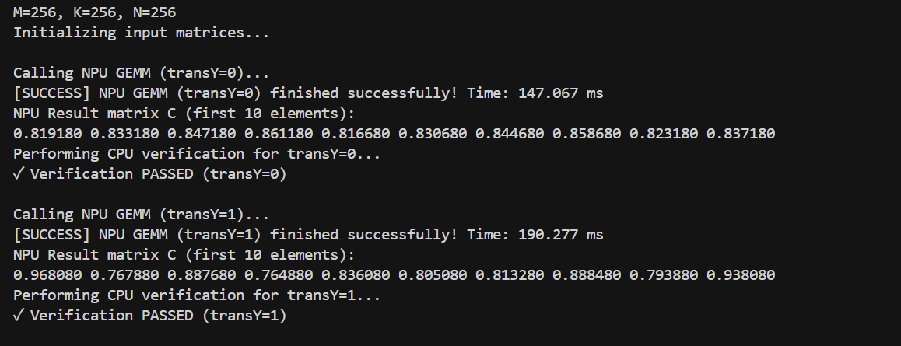
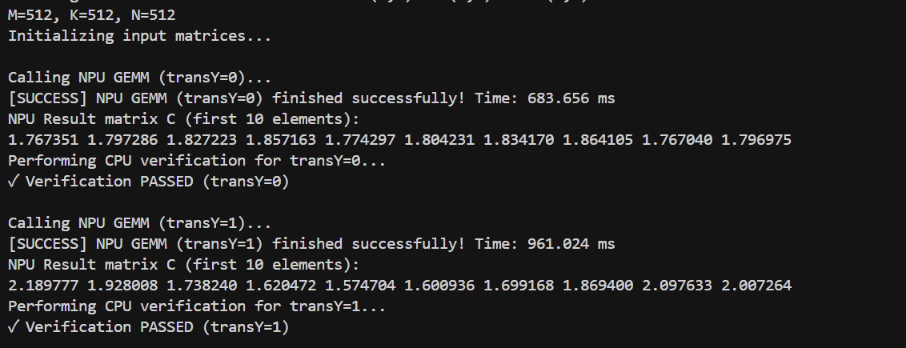
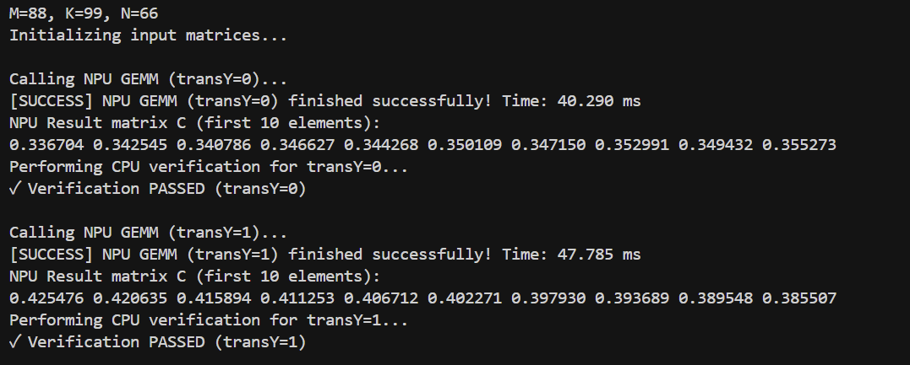

## 任务目标

要求在 `Lab4/dsp/calculator_imp.c` 中实现并比较多种矩阵乘法实现：

- 朴素标量实现（baseline）：直接三重循环实现的 C 语言矩阵乘法，用作基线性能对比；
- 基于 HVX 的内积实现（A * B^T）：对 B 做转置，使得点积（dot-product）可以用向量化内积（内积法）计算；
- 基于 HVX 的外积实现（A * B）：采用外积法，利用标量广播将 A 的单个元素与 B 的一整段向量相乘并累加到 C 的子向量。

实现要求与验收准则：

1. 功能等价：对任意合法输入（浮点矩阵）都应输出误差在浮点容差内的结果；
2. 向量化与对齐：HVX 代码应处理 128 字节（32 float）对齐，说明如何处理尾部不对齐或非 32 倍长度的情形；
3. 性能测量：对不同矩阵尺寸执行并记录；
4. 结果分析：比较三种实现的运行时间与计算效率，并说明在实现中使用到的主要 HVX 指令与它们的作用（例如 vsplat、vmpy、vadd、vror 等）。

实验数据记录表：

- 无论是实体设备还是使用模拟器，启动参数的最后三位分别是矩阵尺寸的M、K、N

| 实验编号 | 实现方式             | 设备/模拟器 | 矩阵尺寸 (M×K×N) | 计算耗时 (ms) | 备注 |
|--------:|----------------------|-------------|------------------:|--------------:|------|
| 1       | 朴素 baseline        | 设备        | 64×64×64          | 50.709        |      |
| 2       | HVX 内积 (A * B^T)   | 设备        | 64×64×64          | 42.348        |      |
| 3       | HVX 外积 (A * B)     | 设备        | 64×64×64          | 33.538        |      |
| 4       | 朴素 baseline        | 设备        | 256×256×256       | 471.996       |      |
| 5       | HVX 内积 (A * B^T)   | 设备        | 256×256×256       | 190.277       |      |
| 6       | HVX 外积 (A * B)     | 设备        | 256×256×256       | 147.067       |      |
| 7       | 朴素 baseline        | 设备        | 512×512×512       | 3592.255      |      |
| 8       | HVX 内积 (A * B^T)   | 设备        | 512×512×512       | 961.024       |      |
| 9       | HVX 外积 (A * B)     | 设备        | 512×512×512       | 683.656       |      |
| 10      | 朴素 baseline        | 设备        | 88×99×66          | 61.470        |      |






分析要点：

1. 对比内积与外积在数据复用、内存访问模式与向量指令使用上的差异：
   - 朴素 baseline：三重循环标量计算，无法复用向量寄存器，访存与计算均为标量，作为性能基线。
   - 内积（A×B^T，对应 `matmul_ikj_transposed_b`）：
     - 数据复用：对每个输出标量 `C[i,j]`，沿 K 维成段（32 个 float）读取 A 的一段与 B^T 的一段做逐元素乘加；A 行在同一 `i` 下会被多个 `j` 复用，但每个输出都需要一次 32→1 的向量规约。
     - 访问模式：A 行与 B^T 行都按 K 维连续加载，顺序友好；写回为按标量写 `C[i,j]`。
     - 向量指令：使用向量乘 `Q6_Vqf32_vmpy_VsfVsf` 与加 `Q6_Vqf32_vadd_Vqf32Vqf32` 完成 32 路并行点乘累加，末尾用旋转 `Q6_V_vror_VR` 做折半求和规约，存在固定规约开销。
   - 外积（A×B，对应 `matmul_ijk`）：
     - 数据复用：将标量 `A[i,l]` 用 `Q6_V_vsplat_R` 广播为 32 路向量，同时更新 `C[i,:]` 的 32 个元素；全过程无向量规约，标量 A 的复用度极高。
     - 访问模式：B 的一整行（按 N 维）被线性扫描并分块（32 float）加载，C 以 32-float 向量块写回；对同一行 `i`，在 K 次循环中会多次读取整行 B，容易受带宽影响，但访存模式顺序、写回批量化。
     - 向量指令：核心为广播 `Q6_V_vsplat_R`、向量乘加（`vmpy`+`vadd`）对多个输出并行累加，无需 `vror` 规约，依赖数组 `acc[section]` 存放 N 方向的多个向量累加器。
   - 实测对比：在 64、256、512 规模上，外积分别较内积约快 1.26×、1.29×、1.41×；两者均显著快于朴素实现。外积避免了每个输出的规约开销，且写回为向量块，因此总体更优。
2. 关键 HVX 指令详解与作用：
   - `Q6_V_vsplat_R`：将 32 位标量广播到 512b 向量的 32 个 lane。用于外积法把 `A[i,l]` 扩展成向量，从而一次性更新 32 个输出，极大提升标量数据复用。
```130:131:Lab4/dsp/calculator_imp.c
    HVX_Vector a_vec = Q6_V_vsplat_R(float_to_bits(input_matrix1[i * k + l]));
    uint32_t remaining = n;
```
   - `Q6_Vqf32_vmpy_VsfVsf`：32 路单精度逐元素乘，内/外积的核心算子，提供 32× 并行度，显著提高 FLOPs 吞吐。
```136:136:Lab4/dsp/calculator_imp.c
    HVX_Vector mul = Q6_Vqf32_vmpy_VsfVsf(a_vec, b_vec);
```
   - `Q6_Vqf32_vadd_Vqf32Vqf32`：32 路逐元素加，用作累加器更新，配合 `vmpy` 形成向量化的 MAC 流水。
```137:137:Lab4/dsp/calculator_imp.c
    acc[s] = Q6_Vqf32_vadd_Vqf32Vqf32(acc[s], mul);
```
   - `Q6_V_vror_VR`：按字节循环右移，用于规约时执行折半求和（16、8、4、2、1）共 5 次旋转 + 5 次向量加，最终将 32 路部分和合并为 1 个标量；仅内积实现需要。
```81:83:Lab4/dsp/calculator_imp.c
    for (int offset = 16; offset >= 1; offset >>= 1) {
        HVX_Vector rotated = Q6_V_vror_VR(reduction, offset * (int)sizeof(float));
        reduction = Q6_Vqf32_vadd_Vqf32Vqf32(reduction, rotated);
```
   - `Q6_Vsf_equals_Vqf32`：将向量的 lane0 解释为标量 float 取出，完成规约收尾。
```86:86:Lab4/dsp/calculator_imp.c
    HVX_Vector acc_sf = Q6_Vsf_equals_Vqf32(reduction);
```
   - `Q6_V_vzero`：生成全 0 向量，用于初始化累加器与尾部零填充。
```126:126:Lab4/dsp/calculator_imp.c
            acc[s] = Q6_V_vzero();
```
   - 载入/存储：当前实现用 `memcpy` 将 ≤32 个 float 搬入/出向量寄存器，规避了对齐限制、便于处理尾部；若数据能保证 128B 对齐，可改用 HVX 对齐载入/存储以进一步降低开销。
```173:174:Lab4/dsp/calculator_imp.c
                memcpy(&a_vec, &input_matrix1[i * k + l], 32U * sizeof(float));
                memcpy(&b_vec, &input_matrix2[j * k + l], 32U * sizeof(float));
```
3. 尾部、对齐、缓存与带宽优化建议：
   - 尾部与对齐：现有做法将不足 32 的余数通过 `memcpy` 搬入向量并以 0 填充，功能正确；在输入 128B 对齐且 `N`、`K` 为 32 倍数的情况下，可去除分支与 `memcpy`，统一走对齐向量载入/存储路径，减少额外开销。
   - 分块（tiling）：对外积实现引入 `K×N` 分块（如 `K_tile=128，N_tile=8×32`），提升 B 的缓存命中并限制一次持有的向量累加器数量，降低寄存器/栈压力；对内积实现可对 `K` 做类似分块并在 `j` 上批处理多个输出。
   - 预取（l2fetch）：对按行扫描的 B 进行 L2 预取；对内积法同时预取 A 行与 B^T 行，隐藏访存延迟。示意：提前若干迭代对下一块数据调用 `l2fetch(ptr, bytes, stride, lines)`。
   - 利用 VTCM：将当前 A 行与一个 B 的 `N_tile` 或 `K_tile` 搬入 VTCM 计算，降低访问时延，尤其对大规模矩阵明显。
   - 指令级并行（ILP）：在 K 循环中做 2–4 路展开，使用多组 `acc` 交错累加，打破 `vmpy`/`vadd` 的数据相关链，提高流水线利用率。
   - 多线程并行：按行（i 维）或按 N 的块划分任务到不同线程/核，结合 VTCM 亲和与合适的任务粒度以避免带宽争用。
   - 写回优化：外积实现保持 32-float 批量写回；若平台支持非临时写（non-temporal store），可减少写分配带来的缓存污染。

延伸讨论（可选）：

- 翻阅硬件手册，查看l2fetch函数的作用，并尝试用在代码实现中，观察变化
- 如果采用了其他的优化手段，请在提交文档中标明
