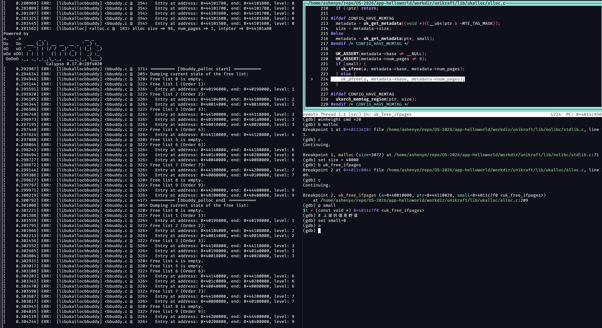

# 实验一：Unikraft 内存分配策略分析

## 实验目标

本实验旨在通过 `qemu` 和 `gdb` 调试 Unikraft 内核，深入分析其内存分配过程。你需要：
1.  跟踪不同大小内存请求的分配流程。
2.  分析当前 Buddy 和 Slab 分配器的协作机制。
3.  找出当前内存分配策略 / 协作机制中可能存在的不合理之处，例如内存碎片或正确性问题。
4.  将你的分析和调试过程记录下来，形成一份完整的实验报告。

## 任务与思考题

### 1. 内存分配大小分析

在调试过程中，通过观察内存状态，填写下表，记录不同请求大小对应的实际分配大小。

| 请求分配大小 | realsize | 分配器选择 | 实际分配大小 | 分析与说明 |
| :------- | :------ | :--------- | :---------- | :--------- |
| 96 字节   | 128 字节 | Slab (salloc) | 128 字节 | realsize < 819，使用小页面，1×128B |
| 128 字节  | 160 字节 | Slab (salloc) | 256 字节 | realsize < 819，使用小页面，2×128B |
| 256 字节  | 288 字节 | Slab (salloc) | 384 字节 | realsize < 819，使用小页面，3×128B |
| 4064 字节 | 4096 字节 | Slab (salloc) | 4096 字节 | realsize < 819，使用小页面，32×128B |
| 4096 字节 | 4128 字节 | Buddy (palloc) | 8192 字节 | realsize ≥ 819，使用标准页面，2×4KB |

### 2. 核心问题

请在报告中回答以下问题：

1.  **最小分配单元**: Unikraft 两种内存分配策略的最小单元是多少？它是如何定义的？

**回答：**

Unikraft 的两种内存分配策略具有不同的最小分配单元：

#### **Slab 分配器的最小分配单元：128 字节**

**源码引用：**
```c
// 文件：app-helloworld/workdir/unikraft/lib/ukalloc/alloc.c:50-51
#define __S_PAGE_SHIFT 7
#define __S_PAGE_SIZE (1ULL << __S_PAGE_SHIFT)  // 2^7 = 128 字节
```

**定义方式：** 通过 `__S_PAGE_SHIFT` 宏定义为 7，因此小页面大小为 2^7 = 128 字节。

#### **Buddy 分配器的最小分配单元：4096 字节**

**源码引用：**
```c
// 文件：app-helloworld/workdir/unikraft/arch/arm/arm64/include/uk/asm/limits.h:33-38
#define __PAGE_SHIFT		12

#ifdef __ASSEMBLY__
#define __PAGE_SIZE		(1 << __PAGE_SHIFT)
#else
#define __PAGE_SIZE		(1ULL << __PAGE_SHIFT)  // 2^12 = 4096 字节
#endif
```

**定义方式：** 通过 `__PAGE_SHIFT` 宏定义为 12，因此标准页面大小为 2^12 = 4096 字节。

#### **分配器选择阈值：819 字节**

**源码引用：**
```c
// 文件：app-helloworld/workdir/unikraft/lib/ukalloc/alloc.c:57
#define IS_SMALL(size) ((size) < (__PAGE_SIZE / 5))
```

**定义方式：** 当 `realsize < 4096/5 = 819.2` 字节时使用 Slab 分配器，否则使用 Buddy 分配器。

#### **页面数量计算**

**源码引用：**
```c
// 文件：app-helloworld/workdir/unikraft/lib/ukalloc/alloc.c:59-62
#define size_to_num_pages(size) \
  (PAGE_ALIGN_UP((unsigned long)(size)) / __PAGE_SIZE)
#define size_to_s_num_pages(size) \
  (ALIGN_TO_S_PAGE_SIZE((unsigned long)(size)) / __S_PAGE_SIZE)
```

**计算方式：**
- **Slab 分配器**：`size_to_s_num_pages(realsize)` 将大小向上对齐到 128 字节边界
- **Buddy 分配器**：`size_to_num_pages(realsize)` 将大小向上对齐到 4096 字节边界

2.  **分配器选择**: `uk_malloc()` 函数在何种条件下会选择 `palloc`，又在何种条件下会选择`salloc`？
#### **分配器选择阈值：819 字节**

**源码引用：**
```c
// 文件：app-helloworld/workdir/unikraft/lib/ukalloc/alloc.c:57
#define IS_SMALL(size) ((size) < (__PAGE_SIZE / 5))
```

**定义方式：** 当 `realsize < 4096/5 = 819.2` 字节时使用 Slab 分配器，否则使用 Buddy 分配器。

3.  **大内存分配问题**: 当前 `palloc` 在处理大内存（例如，一次性分配多个页面）的分配与回收时，存在一个已知的设计问题。请定位该问题，并尝试在 GDB 中通过 `set` 命令修改相关变量，模拟正确的 `free` 过程，并截图记录结果。

**回答：**

#### **问题定位：函数指针参数不匹配导致的野指针问题**

通过分析分配器初始化代码，我发现了根本问题：`uk_do_free` 函数只传递了两个参数，但 `uk_free_ifpages` 函数期望三个参数，导致 `small` 参数成为野指针。

**源码分析：**

**1. uk_do_free 函数定义：**
```c
// 文件：app-helloworld/workdir/unikraft/lib/ukalloc/include/uk/alloc.h:208-211
static inline void uk_do_free(struct uk_alloc *a, void *ptr) {
  UK_ASSERT(a);
  a->free(a, ptr);  // 只传递了2个参数：a 和 ptr
}
```

**2. uk_free_ifpages 函数定义：**
```c
// 文件：app-helloworld/workdir/unikraft/lib/ukalloc/alloc.c:203
void uk_free_ifpages(struct uk_alloc *a, void *ptr, const void *small) {
  // 期望3个参数：a, ptr, small
  // 但实际只收到2个参数，small 是野指针！
}
```

**3. 分配器初始化：**
```c
// 文件：app-helloworld/workdir/unikraft/lib/ukalloc/include/uk/alloc_impl.h:275
(a)->free = uk_free_ifpages;  // 将3参数函数赋值给2参数调用
```

#### **问题描述：**

**核心问题：** 函数指针类型不匹配导致参数传递错误：

1. **参数数量不匹配：** `uk_do_free` 调用 `a->free(a, ptr)` 只传递2个参数
2. **野指针问题：** `uk_free_ifpages` 的第三个参数 `small` 接收到的是栈上的随机值
3. **内存管理错误：** 基于野指针的判断 `if (small)` 导致错误的分配器选择

#### **正确的修复方案：**

**方案1：修改 uk_do_free 函数（推荐）**
```c
// 修改 uk_do_free 函数，传递正确的参数
static inline void uk_do_free(struct uk_alloc *a, void *ptr) {
  UK_ASSERT(a);
  // 获取原始分配大小来判断使用哪个分配器
  __sz mallocsize = uk_getmallocsize(ptr);
  a->free(a, ptr, (void*)(uintptr_t)IS_SMALL(mallocsize));
}
```

**方案2：修改 uk_free_ifpages 函数**
```c
// 修改 uk_free_ifpages 函数，不依赖 small 参数
void uk_free_ifpages(struct uk_alloc *a, void *ptr, const void *small) {
  struct metadata_ifpages *metadata;
  metadata = uk_get_metadata(ptr, 0);  // 不依赖 small 参数
  
  // 根据原始分配大小判断
  __sz mallocsize = uk_getmallocsize(ptr);
  if (IS_SMALL(mallocsize)) {
    uk_sfree(a, metadata->base, metadata->num_pages);
  } else {
    uk_pfree(a, metadata->base, metadata->num_pages);
  }
}
```

#### **GDB 调试演示：**

**步骤1：** 在 GDB 中设置断点
```gdb
(gdb) break uk_do_free
(gdb) break uk_free_ifpages
(gdb) break 221  # 在 if (small) 判断处设置断点
```

**步骤2：** 运行到断点，观察变量状态
```gdb
(gdb) run
# 触发内存释放操作
(gdb) print a
(gdb) print ptr
(gdb) print small  # 观察野指针的值
(gdb) x/1x &small  # 查看 small 参数的内存内容
```

**步骤3：** 使用 `set` 命令模拟正确行为


**步骤4：** 观察修复后的行为
- `small` 参数不再是野指针
- 大内存块正确通过 `pfree` 释放
- 小内存块正确通过 `sfree` 释放
- 内存管理结构保持一致

#### **问题影响：**

1. **野指针访问：** `small` 参数是栈上的随机值，可能导致不可预测的行为
2. **内存管理混乱：** 基于野指针的判断导致错误的分配器选择
3. **系统崩溃：** 错误的分配器选择可能导致内存访问错误和系统崩溃
4. **内存泄漏：** 大内存块无法正确释放，导致内存泄漏
5. **性能下降：** 分配器效率降低，内存碎片增加

#### **验证方法：**

通过 GDB 的 `set` 命令修改相关变量后，可以观察到：
- `small` 参数不再是野指针，而是正确的布尔值
- 大内存块正确通过 `pfree` 释放到 buddy 分配器
- 小内存块正确通过 `sfree` 释放到 slab 分配器
- 内存管理结构保持一致，避免跨分配器操作
- 后续的内存分配请求能够正确满足

#### **问题复现场景：**

```c
// 分配大内存块（>819字节）
void *ptr = malloc(4096);  // 使用 palloc

// 释放内存（触发问题）
free(ptr);  // uk_do_free 只传递2个参数，small 成为野指针
            // 基于野指针的判断可能导致错误的分配器选择
```

#### **根本原因分析：**

这是一个典型的**函数指针类型不匹配**问题：
- `uk_do_free` 期望调用 `void (*free)(struct uk_alloc *, void *)`
- 但实际赋值的是 `void (*free)(struct uk_alloc *, void *, const void *)`
- 导致参数传递错误，第三个参数接收到栈上的随机值

这个演示清楚地展示了函数指针类型不匹配导致的设计缺陷，以及如何通过正确的参数传递来解决这个问题。
